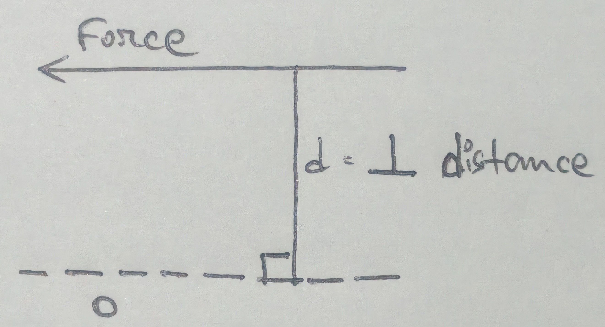

# Force 
- Force is defined as an agent which produces or tends to produce, destroys, or tends to destroy motion. 

## Characteristics of Force 
In order to determine the effects of a force acting on a body, we must know the following characteristics of a force. 

1. Magnitude of force (e.g., 100 N, 50 N, etc.)
2. Direction of line along which the force acts (along OX, along OY, 30$\degree$ NE)
3. Nature of force (whether the force is pushed or pulled)
4. Point at which the force acts on the body (called point of application)

## Principle of Independence of Forces
It states that if a number of forces are simultaneously acting on a particle then the resultant of these forces will have the same effect as produces by all the forces. 

## Principle of Transmissibility of Forces 
It states that if a force acts at any point on a rigid body, it may also be considered to at any other point on its line of action, provided this point is rigidly connected to the body.

## System of Forces 
1. **Co-planar force:** the forces whose line of action lie on the same plane are known as co-planar force. 
2. **Co-linear force:** the forces whose line of action lie on the same line are known as co-linear force. 
3. **Concurrent force:** the forces which meet at one point are known as concurrent forces. The concurrent forces may or may not be co-linear. 
4. **Co-planar concurrent force:** the forces that meet at one point and their line of action also line on the same plane are known as co-planar concurrent forces. 
5. **Co-planar non-concurrent force:** the forces that don't meet at one point and their line of action also lie on the same plane are known as co-planar non-concurrent forces.
6. **Non-coplanar concurrent force:** the forces which meet at one point but their lines of action don't line on the same plane are called non-coplanar concurrent force. 
7. **Non-coplanar non-concurrent force:** the forces that don't meet at one point and their lines of action don't line on the samee plane are called non-coplanar non-concurrent forces. 

## Resultant Force 
If a number of forces, p, q, r, etc., are acting simultaneously on a particle, then it is possible to find out a single force which could replace them, i.e., which would produce the same effect as produced by all the given forces. The single force is called the resultant force. 

### Composition of Forces 
The process of finding out the resultant force of a number of given forces is called composition of forces or compounding of forces. 

### Methods for Resultant Force 
1. Analytical Method 
2. Method of Resolution 

#### Analytical Method for Resultant Force 
1. Parallelogram law of forces 
2. Method of resolution 

##### Parallelogram Law of Forces 
It states that if two forces acting simultaneously on a particle be represented in magnitude and direction by the two adjacent sides of a parallelogram, their resultant may be represented in magnitude and direction by the diagonal of the parallelogram which passes through their point of intersection.  
Mathematically, 

$$
\text{Resultant force, } R = \sqrt{F_1^2 + F_2^2 + 2F_1F_2 \cos \theta}
\\ 
\tan \alpha = \frac{F_2 \sin \theta}{F_1 + F_2 \cos \theta} 
$$

$F_1\ \&\ F_2 = \text{forces whose resultant is required to be found out}$  
$\theta = \text{angle between}\ F1 \&\ F2$  
$\alpha = \text{angle which the resultant force makes with one of the force (here}\ F_1)$

# Note 
## Corollary 
1. If $\theta = 0$, then $R = \sqrt{F_1^2 + F_2^2 + 2F_1F_2}$
    - $\implies \sqrt{(F_1 + F_2)^2}$
    - $R = F_1 + F_2$

2. If $\theta = 90\degree$, then R = \sqrt{F_1^2 + F_2^2}$

3. If $\theta = 180\degree$, then R = \sqrt{F_1^2 + F_2^2 - 2_F_1F_2}$
    - $\implies \sqrt{(F_1 - F_2)^2}$
    - $R = F_1 - F_2$

4. If 2 forces are equal, i.e., $F_1 = F_2 = F$ 
    - $R = \sqrt{F_1^2 + F_2^2 + 2F_1F_2\cos\theta}$
    - $\implies \sqrt{F^2 + F^2 + 2F^2\cos\theta}$
    - $\implies \sqrt{2F^2 + 2F^2 \cos^2 \frac{\theta}{2}}$
    - $\sqrt{2F^2 \cos^2 \frac{\theta}{2}}$
    - $\implies 2F\cos\theta$

# Resolution of a Force 
The process of splitting up the given force into a number of components, without changing its effects on the body is called resolution of a force. 

# Principle of Resolution 
It states that the algebric sum of the resolved parts of a number of forces in a given direction is equal to the resolved parts of their resultant in the same direction. 

> [!NOTE]
> In general, the forces are resolved in vertical and horizontal direction. 

# Bow's Notation
Bow's notation is a letting system used in graphical analysis of trusses and frames spaces between forces in a space diagram are labeled with capital letters (A, B, C). A force is identified by the two letters of the spaces on the either side of it, e.g., AB, BC, CD, etc. This makes it easier to relate the space diagram and the vector diagram when solving problems graphically. 

# Space Diagram 
A space diagram represents the actual structure showing members, joints, supports and external loads. It shows the real arrangement of forces acting on a structure. In graphical static spaces between the forces are labeled using Bow's notation which helps identify forces when constructing the vector diagrams. 

# Vector Diagram 
A vector diagram represents forces as straight lines drawn to scale. The length of the line represents the magnitude of the force and the direction of the line represents the direction of the force. When forces acting on a body are drawn head to tail, they form a closed polygon if the body is in equilibrium. 

# Funicular Polygon (String Polygon)
A funicular polygon also called a string polygon is a graphical construction used to determine the resultant of several forces and the reactions in beams. It is drawn in the space diagram using lines parallel to the rays drawn from a pole in the vector diagram. It shows how forces act on the structure and helps locate the line of action of the resultant force. 

# Moment of a Force 
The moment of a force is the turning effect produced by a force about a point or axis. It is calculated as the product of the magnitude of the force and the perpendicular distance from the point to the line of action of the force. 

## Formula 
$$
M = F \times d 
$$

Where,  
F = force  
d = perpendicular distance 

The SI unit of moment is Nm (newton meter)

- O is the point about which moment is to be calculated. 

## Graphical Representation of Moment 
Graphically a moment is represented by showing a force vector acting at a perpendicular distance from a reference point or a pivot. The force is drawn as an arrow, the perpendicular distance from the pivot to the line of action of the force is indicated, and the rotational effect is shown as clockwise or anti-clockwise. 

## Varignon's Theorem (Principle of Moments)
Varignon's theorem states that the moment of the resultant of a system of forces about any point is equal to the algebric sum of the moments of the individual forces about the same point. This theorem simplifies calculations in engineering mechanics and widely used in build and structural analysis. 
