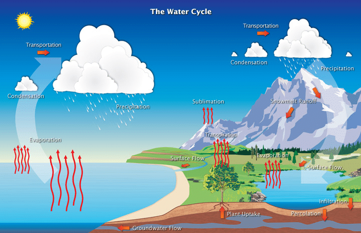
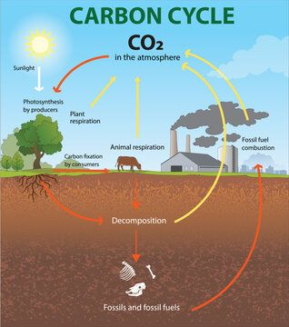
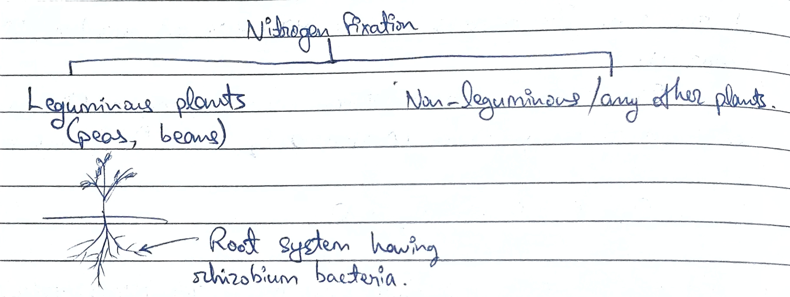
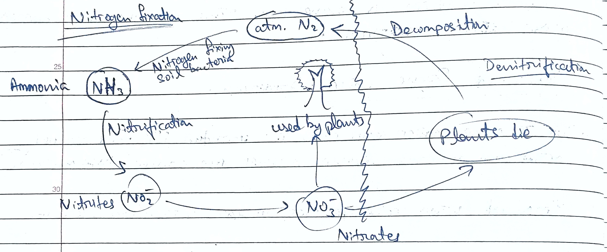
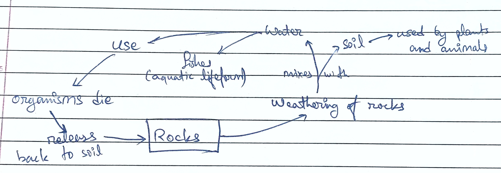
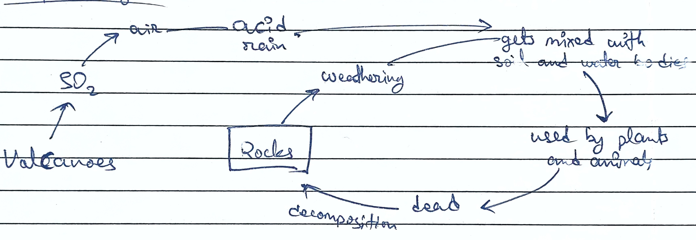

# Introduction to Environmental Sciences and Ecosystems 
- **Meaning of Environment:** the word environment is derived from the French word 'environ' meaning surrounding. 
- **Definition of EVS:** EVS is an interdisciplinary academic field that integrates physical, biological and information sciences (including geology, ecology, physics, chemistry and engineering, etc.) to study environmental problems and human impact on the environment. 
- **Elements of Environment:** 
    1. **Physical elements:** water bodies, rocks, climate, soils, space and landforms.
    2. **Biological Elements:** plants, animals, human beings and microorganisms. 
    3. **Cultural Elements:** economic, social, and political elements which are essential man-made features. 
    
- **Components of Environment:** 
    1. **Hydrosphere:** composed of all water bodies, e.g., ponds, lakes, seas, oceans, etc. 
    2. **Lithosphere:** refers to the outer solid layer of earth. Divided into three parts, i.e., crust, mantle, core. 
    3. **Biosphere:** refers to all living organisms on earth's surface and their interaction with water and air. It consists of plants, animals and microorganisms. 
    4. **Atmosphere:** consists of mixture of gases that protects the earth from harmful radiations of the sun. It is divided into 5 layers- troposphere, stratosphere, mesosphere, thermosphere and exosphere. 

## Scope of EVS 
1. To create awareness about various renewable and non-renewable resources. 
2. It provides necessary information about biodiversity richness and conservation of natural resources. 
3. It helps to understand the causes of natural and man-made disasters. 
4. It provides knowledge about environmental pollution control. 
5. It provides information about social issues in relation to environment and development. 

## Importance of EVS 
EVS has become significant for the following reasons. 

1. **Environmental issues of international importance:** Issues like global warming, ozone layer depletion, marine pollution are global issues that must be tackled with international efforts and cooperation. 
2. **Increase in pollution:** as world pollution is increasing at an alarming rate, it has led to exploitation of natural resources leading to pollution of all types. 
3. **Need for alternative solution:** overconsumption of natural resources causes environmental crisis, so we need to adopt sustainable way of living. 
4. **Problems cropped in the wake of development:** urbanization, industrial growth, agriculture, transportation, etc has led to great number of environmental problems. 

## Ecology 
It is the subject which studies the nature of interaction between living and non-living things. 

## Ecosystem 
An ecosystem is a structural and functional unit of ecology which includes both living and non-living components. 

- **Components of Ecosystem**
    - Biotic 
        - Produces/Autotrophs (produce their own food by photosynthesis)
        - Consumer 
            - Primary consumer/herbivores (cow, goat, horse)
            - Secondary consumers/carnivores (fox, cat)
            - Tertiary consumers (tiger, bear)
        - Decomposers (decomposers break down organic matter and release vital nutrients back into the soil, e.g., bacteria, fungi)
    - Abiotic 

## Functions of Ecosystem 
1. Energy flow 
2. Ecological Succession 
3. Nutrient Cycling

### Energy Flow 
It refers to the movement of energy from primary to various levels of consumers. It takes place via food chain and food web. Energy flow is unidirectional in nature. It is represented by the food chain or food web. 

#### Food Chain 
It is a linear sequence where one living organism and transfer of food or energy takes place. There are two types of food chain- grazing food chain, detritus food chain. 

- **Grazing Food Chain**

| | Terrestrial | Aquatic | 
|:-:|:-:|:-:|
| Tertiary Consumers | Snake | Pelican | 
| Secondary consumers | Lizard | Fish | 
| Primary consumers | Caterpillar | Zooplankton | 
| Producer | Grass | Phytoplankton | 

- **Detritus Food Chain**

It is the type of food chain that starts with dead organic matter. 

Dead organic matter $\rightarrow$ Decomposer (bacteria/fungi) $\rightarrow$ Detrivores (digest dead organic matter, e.g., earthworms, snails) $\rightarrow$ Predators (sparrow, crows, vultures, etc.)

#### Food Web 
1. It reperesents all possible food chains in an ecosystem. 
2. It is not linear 
3. It represents all possible transfer of energy and nutrients. 

### Ecological Succession 
Ecological succession is the process by which species composition of an ecosystem changes over a period of time. 

- Types: 
    1. **Primary succession:** it is the process through which a barren or lifeless area gradually transforms into a stable and complex ecosystem. 
        - $\underset{\text{Pioneer Species}}{\underbrace{\text{Bare rock} \rightarrow \text{Lichens} \rightarrow \text{Small plants and lichens} \rightarrow \text{Grasses and ferns}}} \rightarrow \underset{\text{Intermediate species}}{\text{Grasses, shrubs and shade intolerant trees}} \rightarrow \underset{\text{Climax community}}{\text{Forest}}$
        - Each stage in ecosystem succession is called 'series' or 'serial stage'.
        - Climax community is the last species that is the final product of the ecological succession. 
        - Succession can be natural or man made. 
    2. **Secondary succession:** secondary succession occurs in areas where previously existing community or primary ecosystem gets destroyed by fire, flood or deforestation. 

### Nutrient Cycle (Biogeochemical cycling)
1. **Based on reservoir (storage):** 
    1. Gaseous cycle: carbon cycle, nitrogen cycle, water cycle, oxygen cycle. 
    2. Sedimentary cycle: phosphorous and sulfur cycle 

#### Hydrological (Water) Cycle 

#### Carbon Cycle 
It is a biogeochemical process where carbon compounds are continuously interchanged between the atmosphere and organisms. 

#### Nitrogen Cycle
Plants cannot take nitrogen from air directly except few. So, nitrogen fixation is the process by which atmospheric nitrogen is converted into usable form for plants. 

Leguminous plants have rhizobium bacteria which lives in the root nodules. They use atmospheric nitrogen directly into plant usable form. 

#### Phosphorous Cycle (Sedimentary Cycle)

#### Sulfur Cycle 

# Types of Ecosystem 
## Freshwater Ecosystem 
It includes ponds, lakes, streams, rivers and wetlands which contain low salt content, i.e., below 0.5 parts per thousand and support many aquatic plants and animals.  
There are two types of freshwater: 

1. **Lentic:** lentic ecosystems are still or stagnant water bodies like lakes, ponds, and wetlands. They have higher levels of nutrients and organic matter which can lead to high levels of diversity and productivity. 

2. **Lotic:** lotic ecosystem are flowing water bodies like rivers, streams, etc. They have lower level of nutrients and organic matter but higher level of dissolved oxygen due to the continuous water flow. 

## Terrestrial Ecosystem 
### Forest 
1. A forest is a large area covered predominantly with trees. It serves as habitats for wide range of fauna. 
2. Based on tree density, forests are broadly divided into dense forest and open forest. 
3. Forest covers nearly 30% of the earth's land area. 

#### Types of Forest Ecosystem 
1. Coniferous Forest 
2. Temperate Forest 
3. Tropical Rainforest

### Grassland Ecosystem 
It is an ecological system dominated by grasses and herbaceous plants. Globally, grasslands occupy about 20% of the earth's land surface. E.g.: Prairies (North America), Pampas (South America), Savannas (Africa), Steppes (Eurasia), Downs (Australia). 

### Desert Ecosystem 
Deserts are arid region with specially low or high temperatures and limited vegetation. There are two types of desert ecosystem, i.e., hot desert and cold desert. 

- **Hot Desert:** They are region with high temperature, low precipitation and sandy soil. E.g.: Sahara desert 

- **Cold Desert:** These are high altitude regions with low precipitation (often snow), extreme cold and sparse vegetation. E.g.: Ladakh, Antarctica. 

### Mountain Ecosystem 
Mountain ecosystem refers to the complex network of living organisms and their physical environment found in mountainous regions.  
They are characterized by steep terrain, varying altitudes, low temperature, high winds and reduced oxygen levels as altitude increases. 

- **Functions of Mountain Ecosystem**
    - Biodiversity hotspot 
    - Climate regulation 
    - Carbon sequestration
    - Prevent soil erosion 
    - Water storage via glaciers 
    - Provide essential services including timber, food, minerals, medicinal plants, etc. 
