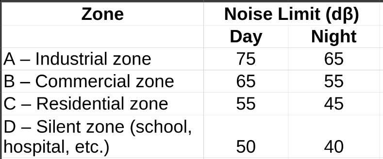

# Air, Noise and Radiation Pollution 
Pollution is the addition of certain harmful waste of air, water and soil by natural sources or certain human activities to such level of volume which adversely affect the quality of environment.  
That is, it is an undesirable change in the chemical, biological or physical structure of the environment, due to which harmful effect on the life of living beings occur.  
Any material that causes pollution of the environment are called pollutant. E.g., particulate matter, $CO_2$, $CH_4$, $H_2S$, $NO_2$, $CO$, $SO_2$. 

Pollutants are classified into two types- 

1. **Primary Pollutant:** these are emitted directly from identifiable sources. E.g., $SO_2$, $CO_2$, $NO_X$, hydrocarbons, etc. 
2. **Secondary Pollutant:** these are derived from primary pollutants by chemical reaction in the environment. E.g., primary pollutant like hydrocarbons and nitrogen oxides react in presence of sunlight to form peroxy acetyl nitrate (PAN) as secondary pollutant; $2SO_2 + O_2 \rightarrow 2SO_3,\ SO_3 + H_2O \rightarrow H_2SO_4$

## Air Pollution 
The presence of one or more contaminant in the atmosphere in large quantities for a duration of time so as to be injurious to any living being or which interferes with normal comfortable life is called air pollution. 

### Sources of Air Pollution 
1. **Natural Sources:** volcanic eruption, forest fire, biological decay, evaporation of volatile organic compounds. 
2. **Man-made Sources:** burning of petrochemicals, burning of gasoline in automobiles, thermal power plants, industrial processes. 

### Major Air Pollutant and their Harmful Effect 
1. **Carbon monoxide and Carbon Dioxide:** carbon monoxide when inhaled reduces oxygen carrying capacity of the blood from lungs to other part of the body. It actually reacts with hemoglobin forming a stable complex called carboxy hemoglobin. 

$$
Hb + O_2 \leftrightarrows HbO_2
\\ 
HbO_2 + CO \leftrightarrows HbCO + O_2
$$

Due to high affinity of $CO$, it's able to displace the oxygen from the $HbO_2$ complex.  
Carbon dioxide is not treated as air pollutant if its concentration is normal, but at higher concentration $CO_2$ is responsible for the rise of atmospheric temperature (global warming). 

2. **Oxides of Nitrogen:** $NO$, $N_2O$, $NO_2$, etc. are added into the atmosphere due to certain human activities. Out of these, $NO$ and $NO_2$ are primary pollutants. $NO$ is a toxic gas, but it is not a serious health hazard because it is not readily soluble in lung tissue. However, it gets oxidized to $NO_2$ under sunlight which is a highly toxic gas. 

$$
Hb + O_2 \leftrightarrows HbO_2 
\\ 
HbO_2 + NO_2 \leftrightarrows HbNO_2 + O_2
$$

Human exposure to $NO_2$ reduces $O_2$ carrying capacity of blood because it forms a stable complex with hemoglobin. 

3. **Oxides of sulfur:** The natural source of $SO_2$ is volcanic eruption. Man-made sources like burning of fossil fuel also produces sulfur dioxide. The primary effect of sulfur dioxide is on respiratory tract. It causes asthma, cough, etc. $SO_2$ has an adverse effect on minerals. It rapidly effects the marble, limestone, etc. $SO_2$ oxidize to $H_2SO_4$ and causes acid rain which causes serious damage to Taj Mahal. 

4. **Hydrocarbon:** compounds that are formed by the composition of hydrogen and carbon are called hydrocarbons, e.g., $CH_4, C_2H_6, C_6H_6,$ etc. Hydrocarbons are emitted by vehicles either as a result of evaporation or incomplete combustion of fuels. Hydrocarbons are mainly known as organic atmospheric pollutants.
    - Effects of hydrocarbons: 
        1. At lower concentration they aren't regarded as harmful pollutants as compared to oxides of carbon, nitrogen, sulfur, etc. However, at higher concentration they may cause cancer. 
        2. Aromatic hydrocarbons like benzene and toluene can cause headache and weakness in our body. 
        3. Cyclic hydrocarbons affect the nervous system. 

# Global Warming or Greenhouse Effect 
A greenhouse is a house made of glass that can be used to grow plants. When the sun rays incident inside the greenhouse the heat is trapped inside and cannot escape out. In polar regions the temperature inside the greenhouse is essential for the growth of plants.   
Similarly, earth is covered by atmosphere where certain gasses like $CO_2$, $CFC$, $CH_4$, etc. are present which are known as greenhouse gasses. When light enters in the atmosphere these greenhouse gasses absorb the heat and prevent theme from reflecting back into the space. This maintains the temperature of the earth and prevent it from freezing. This phenomena is known as Greenhouse effect.  
But nowadays, due to human activities, the amount of greenhouse gasses is increased due to which they absorb very high amount of heat. Therefore, the temperature of earth is increased which causes global warming.  
Example of greenhouse gasses: $CH_4$, $CO_2$, $CFC$, $H_2O$ vapor, $N_2O$ (laughing gas) and $O_3$

- Oxides of nitrogen like $NO$, $NO_2$ aren't greenhouse gas. 

# Ozone Layer Depletion
Ozone means three atoms of oxygen $(O_3)$. The ozone layer is a region in the earth's stratosphere that contains high concentration of ozone and protects the earth from the harmful UV radiation of the sun. It absorbs nearly 97%-99% of harmful UV radiations.  
The ozone in stratosphere absorbs harmful UV radiation and is continuously being converted into $O_2$ and $O$ (atomic oxygen).

$$
O_3 + h\nu \rightarrow O_2 + O 
$$

Also, the oxygen molecule present in the atmosphere react with atomic oxygen and produce $O_3$ and creates an equilibrium of ozone. This equilibrium is disturbed by $CFC$, $N_2O$, etc. which destroys ozone molecules and hence concentration of ozone layer decreases which is referred as ozone hole. This phenomenon is called ozone layer depletion. 

## Effect of Ozone Layer Depletion 
1. Due to ozone layer depletion, the harmful UV rays reaches earth and creates several diseases like cancer, DNA mutation, etc. 
2. Yield of vital crops like rice, wheat, cotton will decrease. 
3. It will result in decrease in the population of marine animals like fish, algae, etc. 

# Acid Rain 
When the pH of rain water is less than 5.6 it is called acid rain.  
Fossil fuel contains compounds such as sulfur, carbon, nitrogen, etc. On combustion, large amount of $SO_2$, $CO_2$, oxides of nitrogen like $NO$, $NO_2$ are formed. These oxides when react with rain water results in acid rain. 

1. The $CO_2$ gas dissolved in rain water forms weak carbonic acid $(H_2CO_3)$
    - $CO_2 + H_2O \rightarrow H_2CO_3$
2. $SO_2$ and $NO_2$ undergo oxidation, and then they react with rain water resulting in the formation of $H_2SO_4$ and $HNO_3$ respectively. 
    - $2SO_2 + O_2 + 2H_2O \rightarrow 2H_2SO_4$
    - $4NO_2 + O_2 + 2H_2O \rightarrow 4HNO_3$

## Effect of Acid Rain 
- **Aquatic life:** aquatic lives are badly affected by acid rain. It may cause disappearance of aquatic species and killing of bacteria, algae, etc. 
- **Ecosystem:** acid rain breaks the food chain and due to this, biodiversity is reduced. 
- **Human health:** acid rain causes skin irritation, hair damage, etc. 
- **Vegetation:** acid rain can decolorize the leaves of plants and reduce the chlorophyll content in vegetable. 

# Radioactive Pollution 
Radioactivity is the phenomenon of spontaneous emission of $\alpha$-rays, $\beta$-rays and $\gamma$-rays due to disintegration of atomic nuclei of some elements. E.g.: $\alpha$-decay of uranium. 

$$
^{238}_{92}U \rightarrow ^{234}_{90}Th + ^4_2He + E 
$$

The emitted radiation can harm living organism and damage the environment, i.e., radioactive pollution is the contamination of the environment by harmful radioactive substances. 

## Sources of Radioactive Pollution 
1. **Natural sources:** radioactive elements like Uranium-235, Uranium-238, Radium-224, Thorium-232. 
2. **Man-made sources:** mining and refining of radioactive materials, leakage from nuclear reactors, use of nuclear weapons, waste of nuclear power plant, etc. 

## Example of Radioactive Pollution 
1. Chernobyl Disaster 
2. Fukushima-Daiichi Nuclear Disaster 

## Effect of Radioactive Pollution 
1. Radiation can damage DNA and increase the risk of cancer. 
2. Radiation may change genes causing birth defect in future generation. 
3. It can damage our immune system. 
4. Long term exposure can damage organs like lungs, bone marrow, etc. 
5. Radioactive particles can make land unsafe for agriculture. 
6. Rivers and groundwater can become contaminated which can affect the aquatic life. 

# Noise Pollution 
- **Sound:** what we hear, we communicate and pleasant to hear is called sound. 
- **Noise:** unwanted sound which isn't pleasant to hear is called noise. 

| Sound | Noise | 
|:-:|:-:|
| It is pleas;nt to hear | Unpleasant to hear | 
| Sound wave is periodic motion | Noise wave has non-periodic motion | 
| Pitch of sound waves is constant | Pitch of noise wave isn't constant | 
| Its unit is Hertz (Hz) | Its unit is Decibel ($d\beta$) |

The disturbance produced in our environment by the undesirable loud sound is called noise pollution. 

## Sources of Noise Pollution 
1. **Transport:** horn of vehicles, vehicles with damaged silencers, noise produced by aeroplanes, etc. 
2. **Industry:** grinding of wheels, generators, rotating machines, etc. 
3. **Others sources:** radio, television, washing machine, firecrackers, loudspeakers, etc. 

## Effect of Noise Pollution 
1. Long term exposure of loud sound (80-90 db) for more than 8 hours a day may cause loss of hearing. 
2. Noise interferes communication with other people.
3. Noise can cause headache, irritation, etc. 
4. Noise increases the blood pressure, heart issues, etc. 
5. Noise can discourage the annual visit of migratory birds to lakes. 

