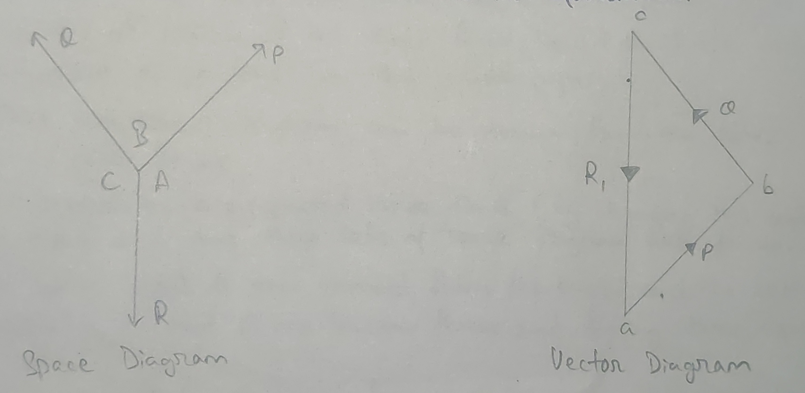
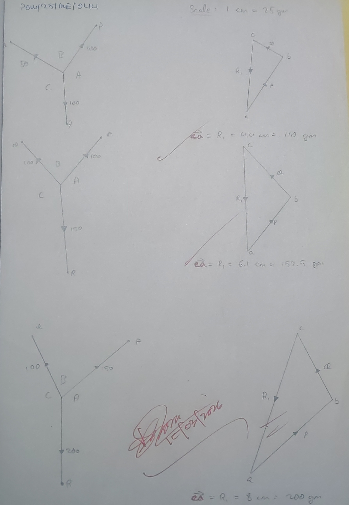

- **Experiment no.:** 01 
- **Title of the Experiment:** Law of Triangle of Forces 
- **Object of the Experiment:** To verify the Law of Triangle of Forces 

## Theory 
Law of Triangle of forces states that if two forces acting simultaneously on a particle be represented in magnitude and direction by the two sides of a triangle, taken in order, then the resultant of these two forces may be represented in magnitude and direction by the third side of the triangle, taken in opposite order.  
Conversely, "If three forces acting at a point be represented in magnitude and direction by the three sides of a triangle, taken in order, then the forces shall be in equilibrium."

## Apparatus Required 
A board fixed on a wall fitted with two pulleys, cords, three scale pan, weight box, fixing pin and a piece of white paper. 

## Procedure 
1. One end of each three cords is attached to a circular ring and the other ends are attached to three scale pan. 
2. Two cords are passed over the two pulleys and the other cord with the pan is kept hanging. 
3. A white paper is fixed behind the cords on the board by means of pins. 
4. Known weight is put on pans and they are allowed to come to equilibrium position. 
5. The three forces P, Q and R are noted down (the weight on the pan + the weight placed on the pan). 
6. The line of action of the three forces (i.e., P, Q, R) are marked by the point of a pencil on the white paper. 
7. Thus the space diagram can be drawn from the three concurrent forces. 
8. The procedures are repeated three times (by changing the weight on the pans) and thus three sets of space diagram are drawn. 
9. The white sheet is now removed from the board and the vector diagram (considering P and Q are known forces and finding their equivalent R) are drawn. 
10. The value of $R_1$, the third force (equilibrant) from the vector diagram are found out and compared with the known value of R. 

## Observation and Results 
| No. of obs. | P (gm) | Q (gm) | R (gm) | $R_1$ from the vector diagram (gm) | Variation $R-R_1$ (gm) | Percentage variation $[(R-R_1)/R]\times 100 \%$ |
|:-:|:-:|:-:|:-:|:-:|:-:|:-:|
| 1. | 100 | 50 | 100 | 110 | 10 | 10% | 
| 2. | 100 | 100 | 150 | 152.5 | 2.5 | 1.66% | 
| 3. | 150 | 100 | 200 | 200 | 0 | 0% | 

## Inference  
1. Due to parallax error, we aren't able to get exact trace of the cord. 
2. Due to friction from pulleys caused by lack of lubrication, we aren't able to get exact weight for equilibrium. 

