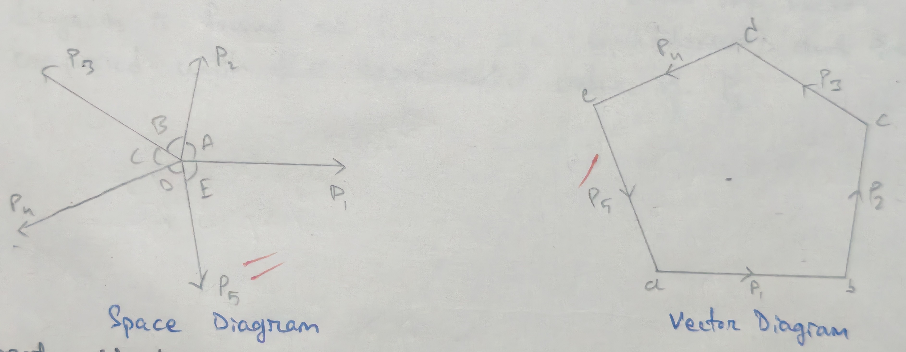
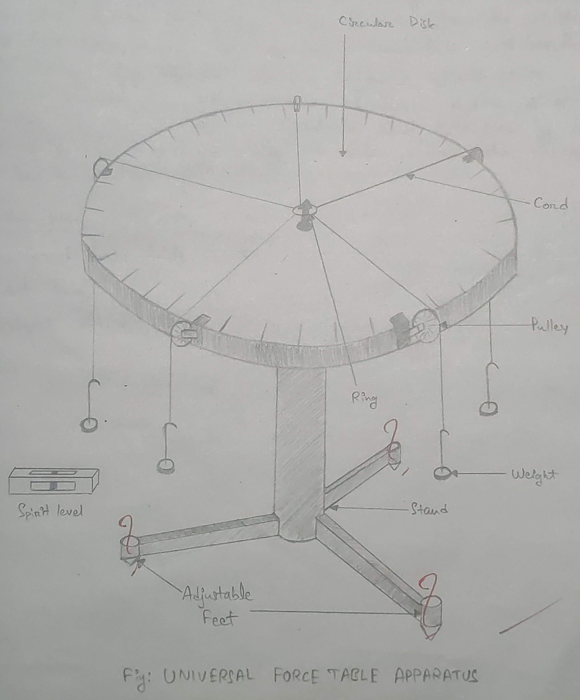

- **Experiment no.:** 2(A)
- **Title of the Experiment:** Law of Polygon of Forces 
- **Object of the Experiment:** To verify the Law of Polygon of Forces 

## Theory 
The law of polygon of forces states that if a number of forces acting simultaneously on a particle be represented in magnitude and direction by the sides of an open polygon, taken in order, then the resultant of all these forces may be represented in magnitude and direction by the closing side of the polygon, taken in opposite order.  
Conversely, "If a number of force acting at a point can be represented in magnitude and direction by the sides of a closed polygon taken in order then the force shall be in equilibrium."

## Apparatus Used 
Universal force table, Spirit level, weight, etc. 

## Procedure 
1. Universal force table is made horizontal by adjusting the base with the help of spirit level. 
2. Known weight are placed at different point at the end of the cords passing over the pulleys. 
3. The position of the pulleys is adjusted to bring the cord (at the other end of the cords) in the center. 
4. Angle $\theta_1,\ \theta_2,\ \theta_3,\ \theta_4,$ etc. between the weights (i.e., in the direction of the force $P_1,\ P_2,\ P_3,\ P_4,$ etc.) are noted down. 
5. The procedure is repeated thrice and the three sets of reading are taken by changing the weights. 
6. The space diagram and the corresponding vector diagram are then drawn (considering $P_1,\ P_2,\ P_3,\ P_4$ as known force in finding out their equilibrium $P_5$)
7. The value of $P_5$, the fifth force, from the vector diagram is found out (i.e., the equilibrant) and then compared with the experimental value of $P_5$. 

## Observation and Result 
| No. of obs. | $P_1$ (gm) | $P_2$ (gm) | $P_3$ (gm) | $P_4$ (gm) | $P_5$ (gm) | $\theta_1$ (deg) | $\theta_2$ (deg) | $\theta_3$ (deg) | $\theta_4$ (deg) | $\theta_5$ (deg) | Variation $P_5$ & $P_5'$ (gm) | Percentage variation $[\frac{P_5~P_5'}{P_5}\times 100%]$
|:-:|:-:|:-:|:-:|:-:|:-:|:-:|:-:|:-:|:-:|:-:|:-:|:-:|
| 1. | 50 | 50 | 50 | 70 | 50 | 70$\degree$ | 60$\degree$ | 80$\degree$ | 70$\degree$ | 80$\degree$ | 5 | 10% | 
| 1. | 50 | 50 | 50 | 50 | 70 | 90$\degree$ | 50$\degree$ | 70$\degree$ | 100$\degree$ | 50$\degree$ | 4 | 5% | 
| 1. | 50 | 50 | 60 | 50 | 50 | 70$\degree$ | 80$\degree$ | 70$\degree$ | 70$\degree$ | 70$\degree$ | 0 | 0% | 

## Inference 
1. Due to insufficient weight we are not able to get accurate result. 
2. The pullies are not properly lubricated, so we are not able to attain accurate equilibrium. 

