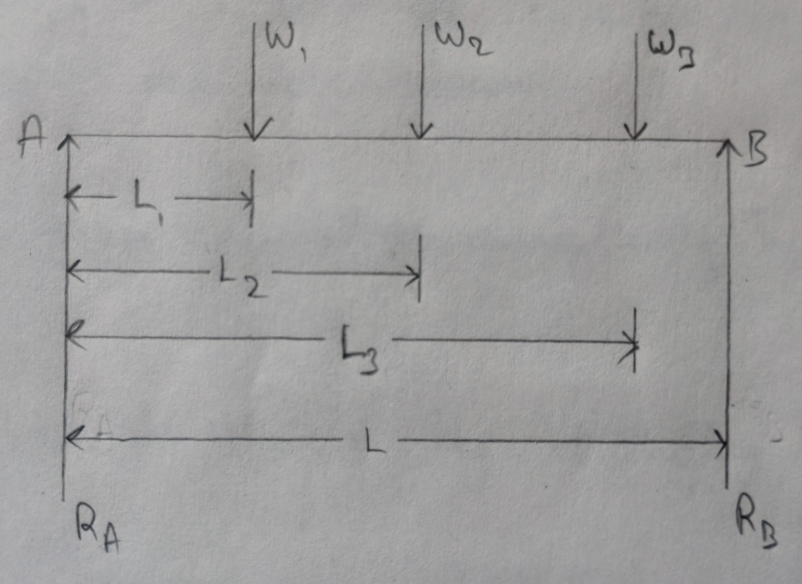
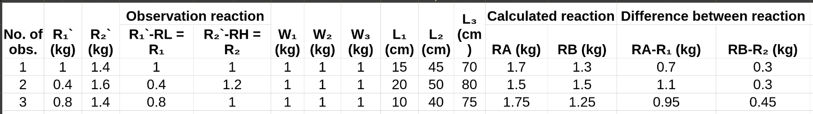
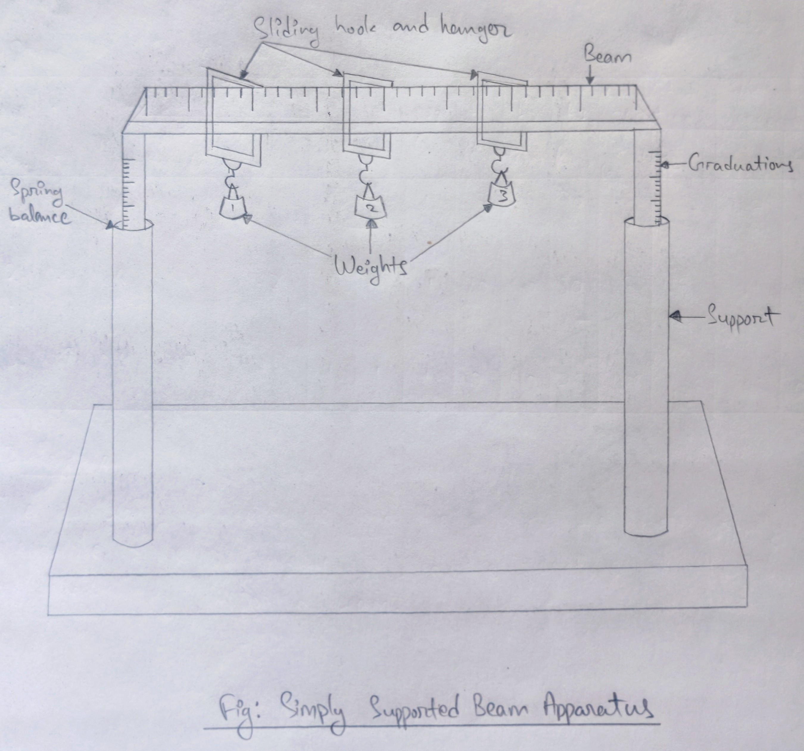

- **Experiment no.:** 04
- **Title of the Experiment:** Simply Supported Beam 
- **Object of the Experiment:** To find the reactions at the supports of a simply supported beam and to verify them analytically, i.e., to verify the 'Law of Moments'.

## Theory 
The law of moments states that if a number of co-planer forces acting on a body are in equilibrium, the algebraic sum of the moments of the forces about any point is equal to zero, i.e., the sum of the clockwise moments about a point is equal to the sum of anti-clockwise moments about the same point.  
If $R_A$ and $R_B$ be the reactions at the supports A and B respectively of a simply supported beam of a span $L$ subjected to point loads of $W_1$, $W_2$ and $W_3$ at distance $L_1$, $L_2$ and $L_3$ respectively from the left hand support, 

$R_B \times L = W_1L_1 + W_2L_2 + W_3L_3$  
$R_B = (W_1L_1 + W_2L_2 + W_3L_3) / L$ ------(1)

Again,  
$R_A+R_B = W_1 + W_2 + W_3$  
$R_A = (W_1 + W_2 + W_3) - R_B$ -------(2)

## Apparatus Used 
Simply supported beam apparatus, weights 

## Procedure 
1. The span of the beam is noted down. 
2. The original reading of the reaction of the two supports $R_L$ and $R_H$ are noted down. 
3. Known weights are put gently on the hangers and the reading of the reaction at the two supports $R_1$ and $R_2$ are noted down. 
4. The difference of the two readings ($R_1\prime - R_L$) and $(R_2\prime - R_H)$ gives the observed reactions $R_1$ and $R_2$ at the supports. 
5. The weights $W_1$, $W_2$ and $W_3$ and their distances $L_1$, $L_2$ and $L_3$ known from the left support are noted down. 
6. The reactions $R_A$ and $R_B$ are then calculated analytically by applying equations 1 and 2. 
7. The above procedure are repeated thrice by changing the weights as well as their positions. 

## Observations and Results 
- Span of the beam, $L$ = 100 cm 
- Original reading of the reaction of the left support, $R_L$ = 0 kg 
- Original reading of the reaction of the right support, $R_H$ = + 0.4 kg 

## Observation Table 

## Inference 
The numbering of the scale and the supports are not properly readable so we are unable to find the reactions of the supports of the simply supported beam. 

