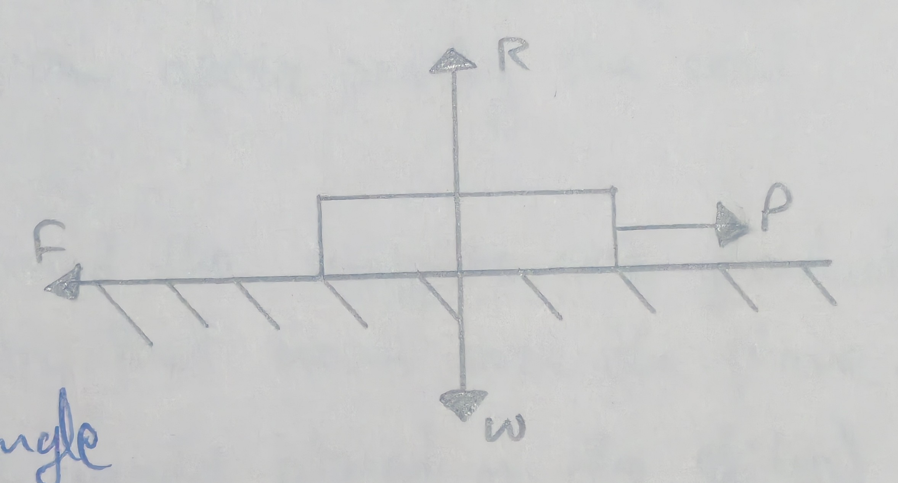
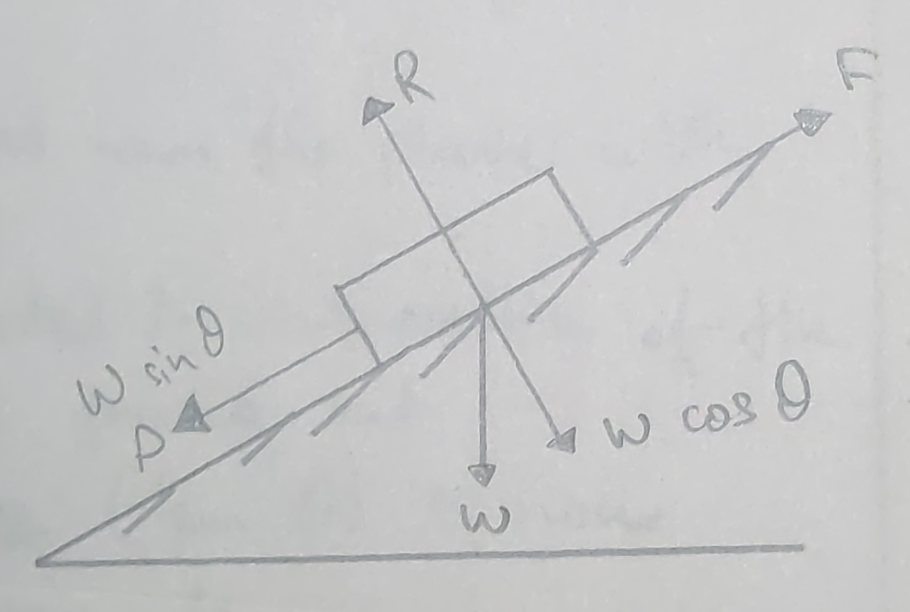
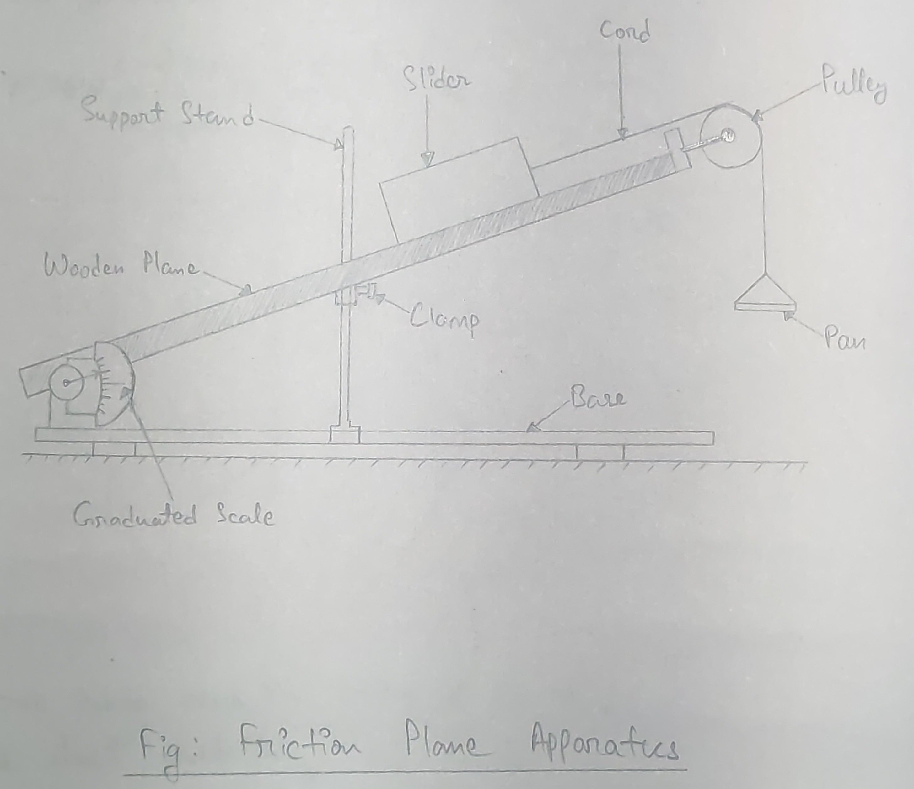

- **Experiment no.:** 05 
- **Title of tfhe Experiment:** Friction    
- **Object of the Experiment:** To determine the coefficient of friction and the angle of repose. 

## Theory 
The coefficient of friciton, $\mu$, is the ratio of the limiting friction, F, and the normal reaction, R, between the two bodies. 

$\mu = F / R$

As, $F = P$ and $R = W$,

$\therefore \mu = P /W$

The angle of repose, $\theta$, is the limiting angle made by a plane with the horizontal.  
When a body placed on the plane just begins to slide down the plane, 

$\text{Resolving along the plane, } F = W\sin\theta$ -------- (1)  
$\text{Resolving normal to the plane, } R = W\cos\theta$ ------- (2) 

Dividing (1) by (2), 

$\frac{F}{R} = \frac{W\sin\theta}{W\cos\theta}$  
$\frac{F}{R} = \tan\theta$

But $F/R = \mu$, the coefficient of friction,  
$\therefore \mu = \tan\theta$

## Apparatus Used 
Friction apparatus, slider, pan, cord, weight box, spirit level 

## Procedure 
1. The surface of the plane table and the bottom of the slider are rubbed and cleaned. 
2. The plane table is made horizontal with the help of spirit level. 
3. One end of the cord is attached to the hook of the slider and the other end is attached to the scale pan after passing the cord over the pulley. 
4. A known weight is placed on the slider and the weights are gradually put on the pan gently till the slider just moves over the plane. 
5. The value of W (weight of the slider and the weight placed on the slider) and the value of P (weight of pant plus the weight placed on the pan) are noted down and the value of coefficient of friction is found out. 
6. The cord and the pan are removed from the slider and is placed at the pulley and the plane table and the original reading of the graduated scale is noted down. 
7. The plane is gradually lifted till the slider moves down the plane with uniform velocity. 
8. The final reading of the graduated scale is noted in this position of the plane from which the angle of repose $\theta$ is found out.
9. The value of the tangent of the angle of repose ($\tan \theta$) is now compared with the coefficient of friction, $\mu$. 
10. The above procedures are repeated thrice. 

## Observation and Result 
- Weight of the slider, $W_1$ = 250 gm 
- Weight of the pan, $P_1$ = 25 gm 
- Original reading of the graduated scale, $\theta_1 = 0\degree$ 

| No. of obs. | Weight on the slider, $W_1\ (\text{gm})$ | Weight on the pan, $P_2\ (\text{gm})$ | $W = W_1 + W_2$ (gm) | $P= P_1 + P_2$ (gm) | $\mu = P/W$ | Final reading of the slider in degree, $\theta_2$ | Angle of repose, $\theta = \theta_2 - \theta_1$ | $\tan\theta$ | Difference between $\mu$ ~ $\tan\theta$ | 
|:-:|:-:|:-:|:-:|:-:|:-:|:-:|:-:|:-:|:-:|
| 1. | 5 | 130 | 255 | 155 | 0.60 | $23\degree$ | $23\degree$ | 0.42 | 0.18 | 
| 2. | 10 | 150 | 260 | 175 | 0.67 | $24\degree$ | $24\degree$ | 0.44 | 0.23 | 
| 3. | 15 | 159 | 265 | 184 | 0.69 | $25\degree$ | $25\degree$ | 0.46 | 0.23 | 

## Inference 
1. The surface of the plane table and the bottom of the slider is not clean as there are dust particles. 
2. The graduated scale cannot be properly measured due to parallax error. 
3. The pulley is not in good condition. 

