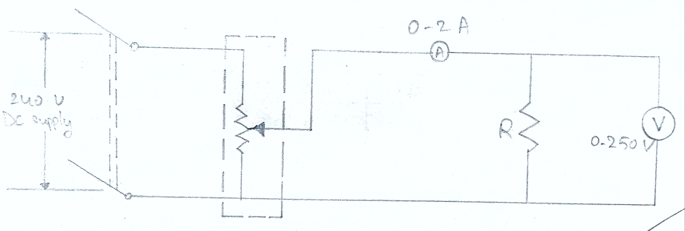
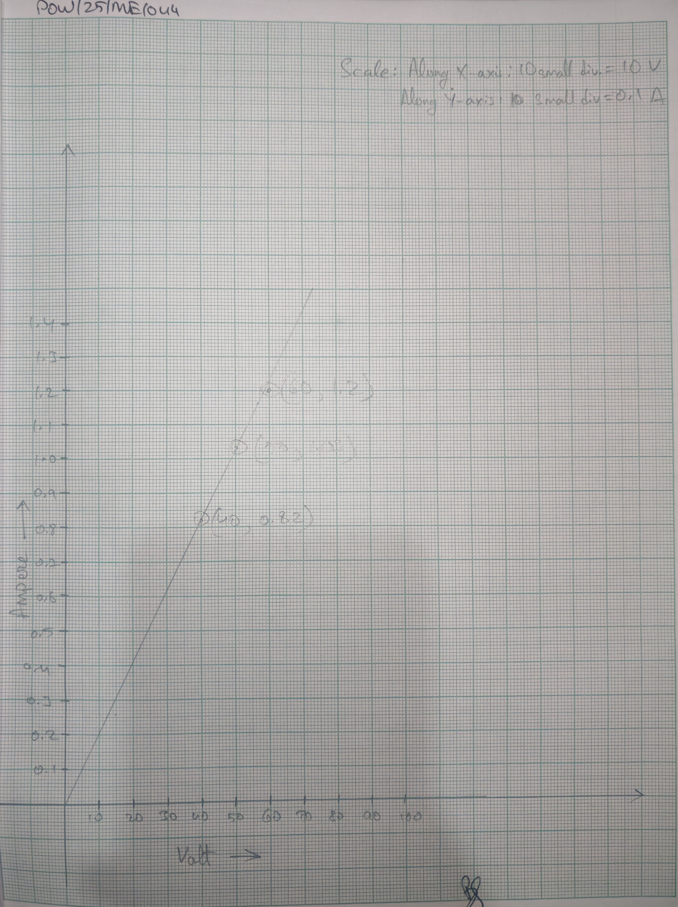

# Cover 
- **Name of the Experiment:** Measurement of Resistance by Ammeter and Voltmeter 
- **Experiment no:** 02 

# Journal Page 
- **Experiment no.:** 02 
- **Title:** Measurement of resistance by ammeter and voltmeter. 
- **Objective:** To verify Ohm's law by passing known current through a resistance at known pressure and to determine the unknown resistance. 

- **Principle Involved:** In any circuit or part of a circuit the current is directly proportional to applied pressure and inversely to the resistance according to Ohm's law.  
Hence, $I = V/R$ or $R= V/I$

Where,  
$I$ is the current in Amperes  
$V$ is the pressure in Volts  
$R$ is the resistance in Ohm 

## Circuit Diagram 

## Procedure 
1. Connect the circuit as shown in the figure. 
2. 240 V DC supply is taken in the circuit. 
3. Apply the voltage and take the reading of ammeter and voltmeter. 
4. With the help of potential divider we take different values of voltage and current. 
5. Applying Ohm's law, $IR = V \implies R = V/I$ we find the value of resistance. 

## Observation 
| S. No. | Current in Amp (I) | Pressure V in Volt (V) | Resistance R in Ohm | Average value of R in Ohm | 
|:-:|:-:|:-:|:-:|:-:|
| 1. | 0.82 | 40 | 48.8 | | 
| 2. | 1.03 | 50 | 48.5 | 49.1 |  
| 3. | 1.2 | 60 | 50 | | 

## List of Equipments 
| S. No. | Item | Specification | Maker's name | Quantity | 
|:-:|:-:|:-:|:-:|:-:|
| 1. | Voltmeter | 0-300 V | MECO | 1 | 
| 2. | Ammeter | 0-2 A | MECO | 1 | 
| 3. | Rheostat | 101 $\Omega$, 5 A | British Electrical Instrument | 2 | 

**Remark**: Due to instrumental error we are not able to get accurate result. 

