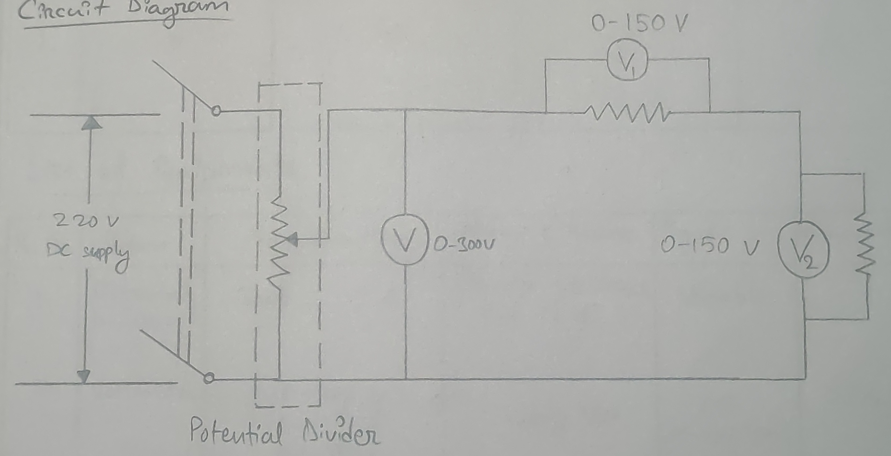

- **Experiment no.:** 04 
- **Name of the Experiment:** Kirchhoff's Voltage Law (KVL) 
- **Object of the Experiment:** To verify the Kirchhoff's Voltage Law (KVL) 

## Theory 
Kirchhoff's Voltage Law (KVL) states that for a closed loop series path the algebraic sum of the voltages around any closed loop is equal to zero.   
KVL deals with the conservation of energy around a closed circuit path. 

## Circuit Diagram 

## Procedure 
1. Correct all the apparatus as shown in the diagram. 
2. In the circuit three rheostats are taken as variable. 
3. Supply 220 V DC supply and take the value from the voltmeters connected in parallel with the rheostat. 
4. Similarly, we should take three more readings. 

## Observation Table 
| S. No. | Voltage (V) (volts) | Voltage $(V_1)$ (volts) | Voltage $(V_2)$ (volts) | $V_1 + V_2$ (volts) | 
|:-:|:-:|:-:|:-:|:-:|
| 1. | 5 | 4 | 1 | 5 | 

## List of Equipments 
| S. No. | Item | Specification | Maker's Name | Type | Quantity | 
|:-:|:-:|:-:|:-:|:-:|:-:|
| 1. | Potential Divider | | British Electrical Private Limited | Variable | 1 | 
| 2. | Voltmeter | 0-300 V, 0-150 V, 0-150 V| Very Volt | MI (Moving Iron) | 3 | 
| 3. | Wire | - | - | - | Many | 

