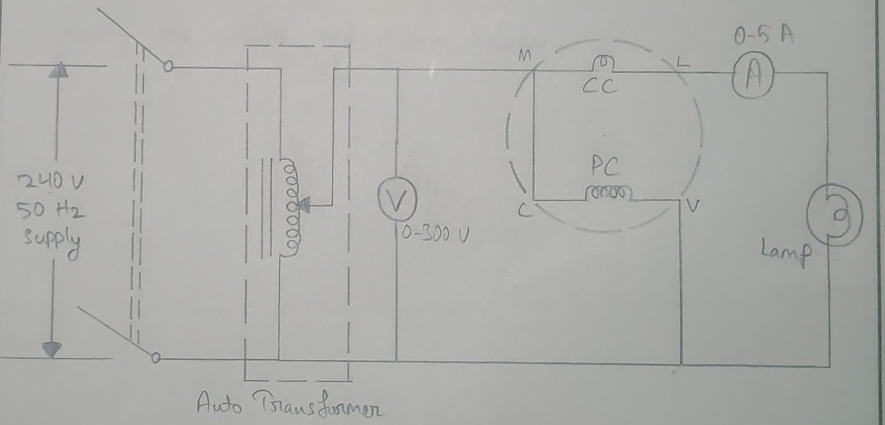
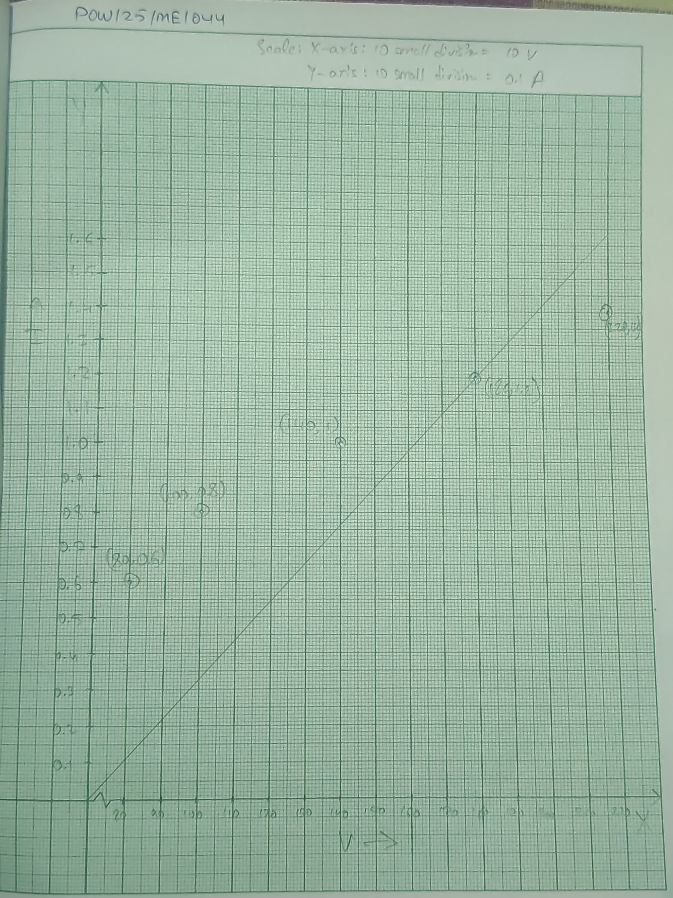

- **Experiment no.:** 05 
- **Name of Experiment:** Measurement of AC power and PF 
- **Object of the Experiment:** To measure 1-phase power by ammeter and voltmeter method and to compare with a voltmeter. 

## Theory 
The AC power in a circuit is the product of voltage across the circuit and the current and power factor is the product of voltage, current and phase angle. The same power can be measured directly by a wattmeter as shown in figure. Thus knowing voltmeter and ammeter reading corresponding power can be found and the results can be compared with wattmeter reading. 

PF of the lamp load = 1 

## Circuit Diagram 

## Procedure 
1. Connect the circuit with the load and measurement instruments. 
2. Set up the wattmeter and multimeter according to the lab instructions. 
3. Measure the RMS voltage using a voltmeter. 
4. Measure the RMS current using an ammeter. 
5. Measure the active power using a wattmeter. 
6. Measure the phase angle between voltage and current. 
7. Calculate the power factor using the formula: $PF = \cos \Phi$
8. Record the measurement and calculations 
9. Analyze the data to determine the power factor and AC power. 
10. Verify the results and ensure accuracy. 

## Observation Table 
| S. No. | Voltmeter reading in volt (V) | Ammeter reading in Amp (A) | Apparent power in volt-amp (VA) | True power voltmeter reading in Watt (VI) | Power factor = True power/Apparent Power = $VI\cos\Phi/VI$ | 
|:-:|:-:|:-:|:-:|:-:|:-:|
| 1. | 80 | 0.6 | 48 | 20 | 0.41 | 
| 2. | 100 | 0.8 | 80 | 30 | 0.73 | 
| 3. | 140 | 1 | 140 | 60 | 0.42 | 
| 4. | 180 | 1.2 | 216 | 100 | 0.06 | 
| 5. | 220 | 1.4 | 308 | 160 | 0.51 | 

## List of Equipments 
| S. No. | Item | Specification | Maker's Name | Type | Quantity | 
|:-:|:-:|:-:|:-:|:-:|:-:|
| 1. | Voltmeter | 0-300 V | MECO Instrument Pvt. Ltd. | MI | 1 | 
| 2. | Ammeter | 0-5 A | MECO Instrument Pvt. Ltd. | MI | 1 | 
| 3. | Auto Transformer | 0-270 V | Accurance | Core Type | 1 | 
| 4. | Wattmeter | 0-1500 W | Very Volt | Core Type | 1 | 
| 5. | Bulb | 100 W | - | Tungsten | 2 | 
| 6. | Wires | - | - | - | Many | 

