# Identification of Components 
## 1. Diode 
A diode is an electronic components that allows current to flow in only one direction. It has two terminals: 

- Anode (positive side)
- Cathode (negative side)

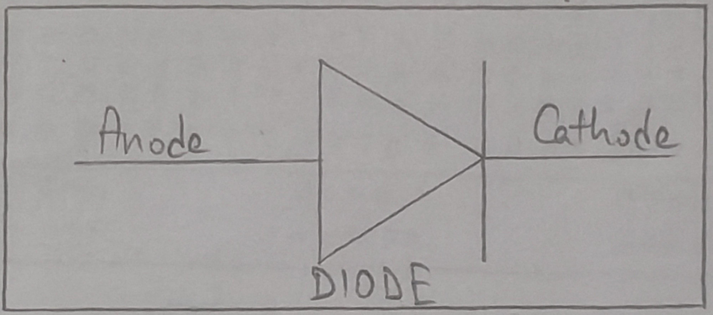

## 2. Zener Diode 
A zener diode is a special type of diode designed to allow current to flow in the reverse direction when a specific predetermined reverse voltage (zener voltage) is reached. 

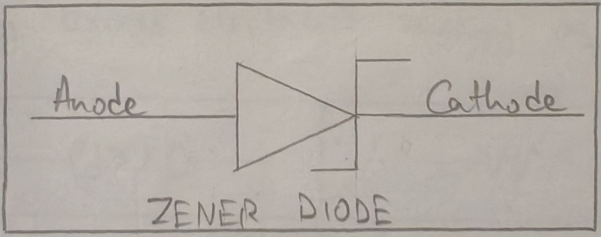

## 3. Bread Board 
A bread board is a reversible rectangular board used to build and test electronic circuits without soldering. It has a grid of holes where electronic components and virus can be inserted to create temporary circuits. Inside the board, metal strips connect certain rows and columns to allow current to flow in certain rows and columns between components. 

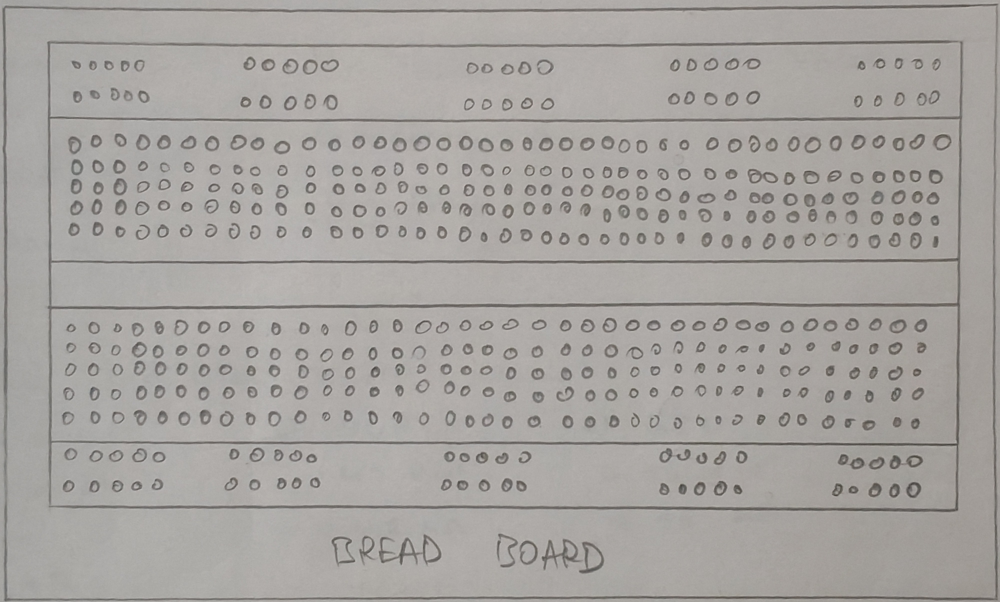

## 4. Resistor 
A resistor is a passive two-terminal electrical component that 
imits or regulate the electric current by slowing down or dissipating excess electrical energy as heat. 

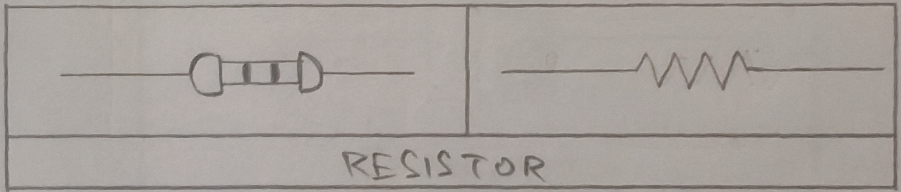

### Tolerance 
- Gold: 5% 
- Silver: 20% 
- No color: 20% 

### Color Code 
- B - Black - 0 
- B - Brown - 1 
- R - Red - 2 
- O - Orange - 3 
- Y - Yellow - 4 
- G - Green - 5 
- B - Blue - 6 
- V - Violet - 7 
- G - Gray - 8 
- W - White - 9 

### Formula 
$\text{1st color } \cdot \text{ 2nd Color} \times 10^C \text{ color}$

1. $R\cdot R \times 10^R$
    - $22 \times 10^2$ 
    - $2200$
    - $2.2\ k\Omega$
2. $YVR$ 
    - $47 \times 10^2$
    - $4700$
    - $4.7\ k\Omega$
3. $GBO$
    - $56 \times 10^3$
    - $56000$
    - $56\ k\Omega$

## 5. Capacitor 
A capacitor is an electronic component that stores and releases electrical energy in a circuit. It consists of two conductive plates separated by an insulating material called dielectric.

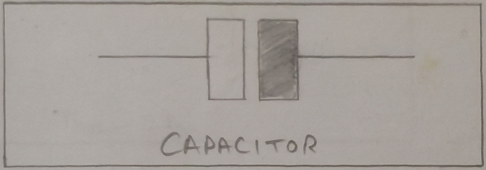

## 6. Digital Multimeter
A digital multimeter is an electronic measuring tool to find electrical values such as voltage, current and resistance in SI units volts, amperes and ohms in digital precision. 

## 7. LED (Light Emitting Diode)
LED stands for light emitting diode. IT is a semiconductor device that emits light when an electric current passes through it. 

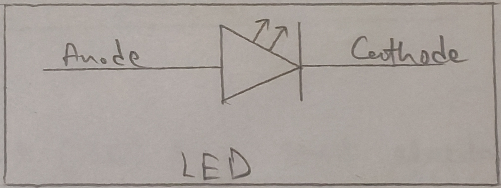

## 8. Transistor 
A transistor is an electronic component that controls the flow of current and can be used as a switch or amplifier in electric circuits. 

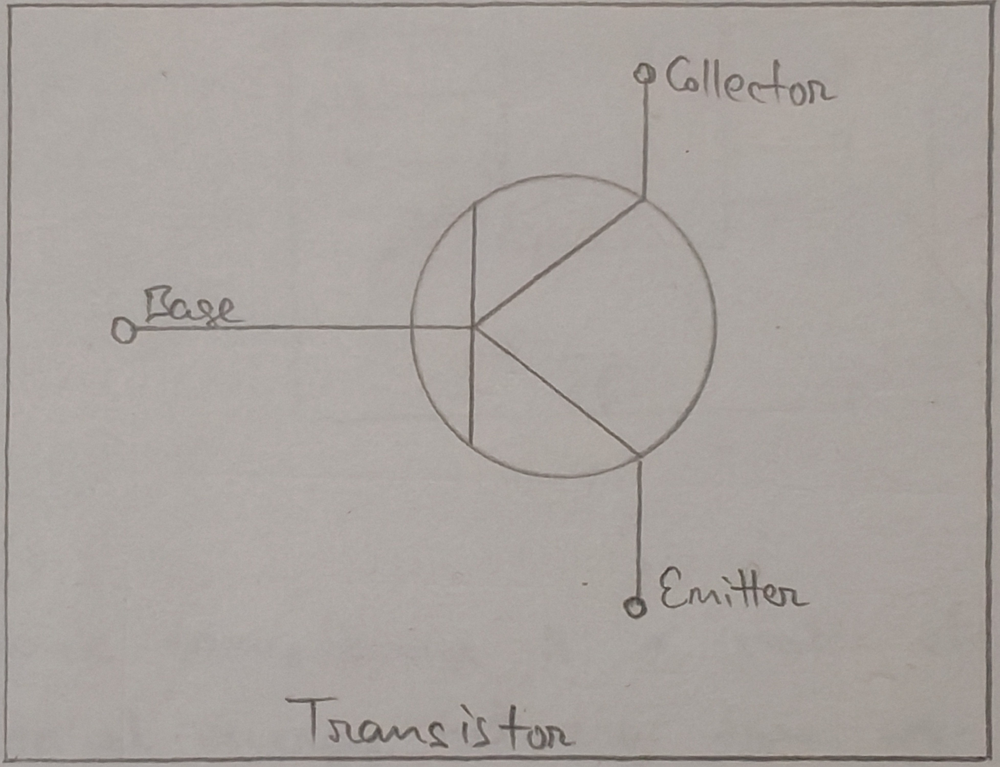

## 9. Inductor 
An inductor is an electronic component that stores energy in a magnetic field when current flows through it.  
Inductors oppose changes in current and are used for various applications like filtering signals, storing energy in power supplied and protecting circuits from current spikes. 

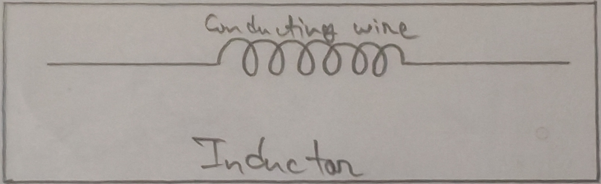

## 10. Integrated Circuits 
An integrated circuit (IC) is a small electronic device made of a semiconductor material typically silicon, that contains a large number of components such as transistors, resistors, capacitors and diodes that work together to perform specific electrical functions. 

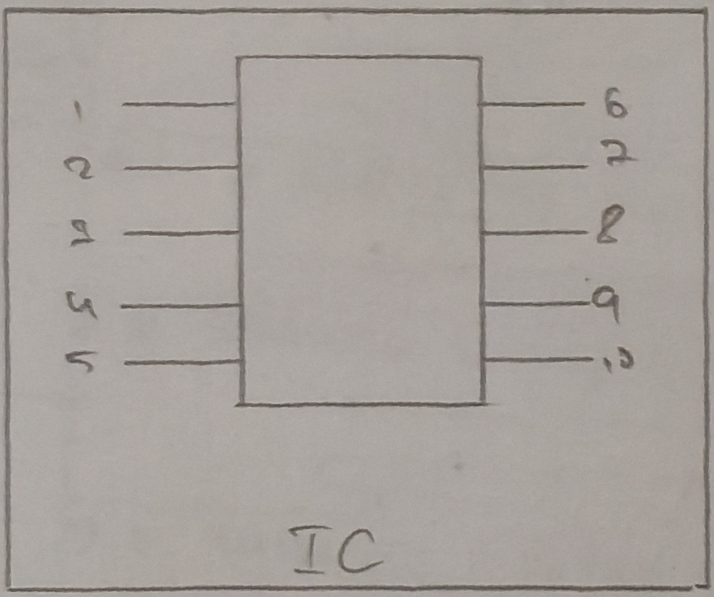

## 11. Transformer
An electric transformer is a static electrical device that transfers electrical energy between two or more circuit through electromagnetic induction. It is primarily used to increase (step-up) or decrease (step-down) the voltage levels in an alternating current (AC) system.

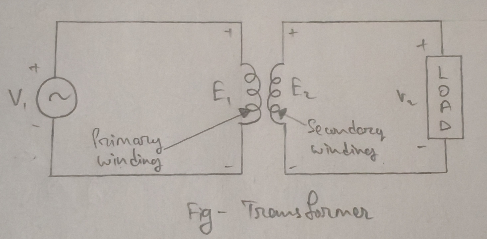

## Display Board on Wires and Cables 
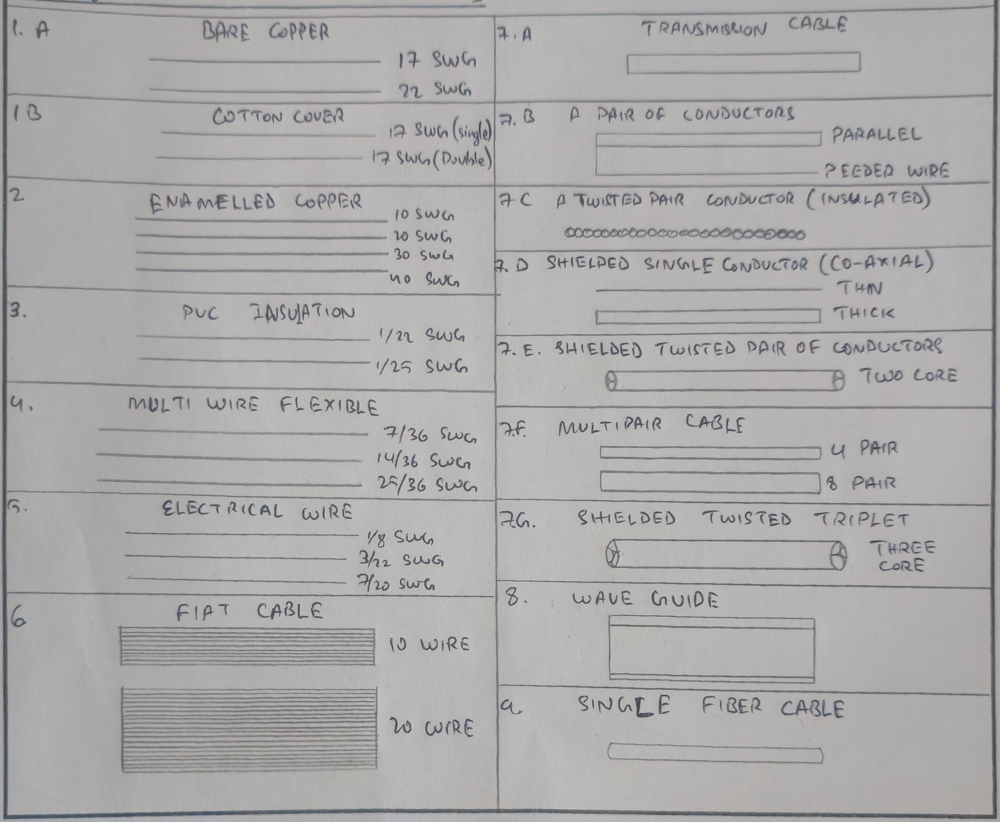
