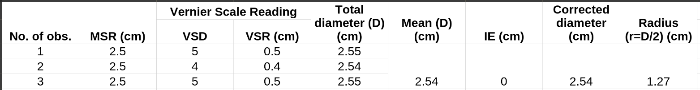
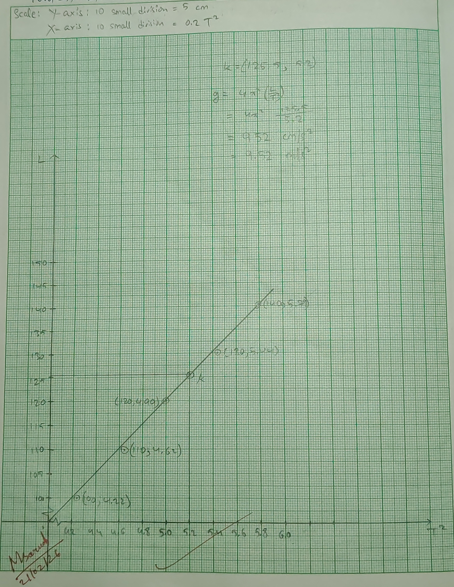

## Aim of the Experiment 
To determine the value of acceleration due to gravity (g) of a place with simple pendulum. 

## Apparatus used 
Simple pendulum with stand, stopwatch, slide calipers, meter scale, split cork and fine thread. 

## Theory 
The time period of a simple pendulum is given by, 

$$
T = 2\pi\sqrt{\frac{L}{\g}}
$$

Where,  
L = effective length of pendulum  
g = acceleration due to gravity

So, the acceleration due to gravity is: 

$$
g = 4\pi^2(\frac{L}{T^2})
$$

## Procedure 
1. The diameter of the bob is measured by slide calipers. It is repeated thrice and the average of three values is taken. Half of the value is the radius of the bob. 
2. The thread is passed through the two split parts of the cork and is clamped on the stand. 
3. The bob is suspended from the support at the edge of a table. The length of the thread from the point of suspension to the foot of the hook of the bob is adjusted that effective length becomes an integer. 
4. The bob is then drawn through a small distance and let go. At the same time the stopwatch is started. The bob starts oscillating. The time required for twenty oscillations is recorded. From the value, the time period is calculated. 
5. Step 4 is repeated for five times by reducing the length of the thread by 10 cm at each step 
6. The values of the acceleration due to gravity is calculated by using the equation given above and then the average value is calculated. 

## Observation 
- The radius of the bob, 
    - Value of smallest MSD = 0.1 cm 
    - VC = 0.01 cm 
    - IE = 0 

## Table for Measurement of Radius 

## Table for Calculation of Time Period 
| No. of obs. | Length of thread (l) (cm) | Effective length (L) (cm) | Time for Twenty oscillations (seconds) | Time period (T=t/20) (seconds) | $T^2$ $(\text{sec}^2)$ | Acc. due to gravity $g=4\pi^2 (\frac{L}{T^2}) (m/s^2)$ | Average value of g $(m/s^2)$ | 
|:-:|:-:|:-:|:-:|:-:|:-:|:-:|:-:|
| 1. | 138.73 | 140 | 48.16 | 2.40 | 5.79 | 9.54 | |
| 2. | 128.73 | 130 | 46.69 | 2.33 | 5.44 | 9.54 | |
| 3. | 118.73 | 120 | 44.72 | 2.23 | 5.99 | 9.49 | 9.44 |
| 4. | 108.73 | 110 | 43.03 | 2.15 | 5.62 | 9.39 | |
| 5. | 98.73 | 100 | 41.10 | 2.05 | 5.22 | 9.35 | |

## Result 
The value of acceleration due to gravity at the place is 9.44 $m/s^2$. 

## Precautions 
1. Release the bob gently without giving any initial velocity. 
2. Ensure the pendulum doesn't swing in elliptical motion. 
3. Fix the suspension point firmly so that it doesn't move during oscillations. 
