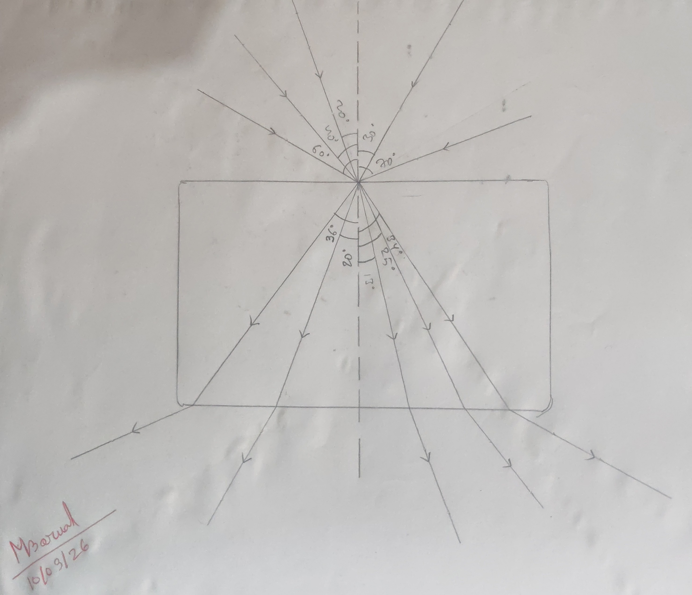
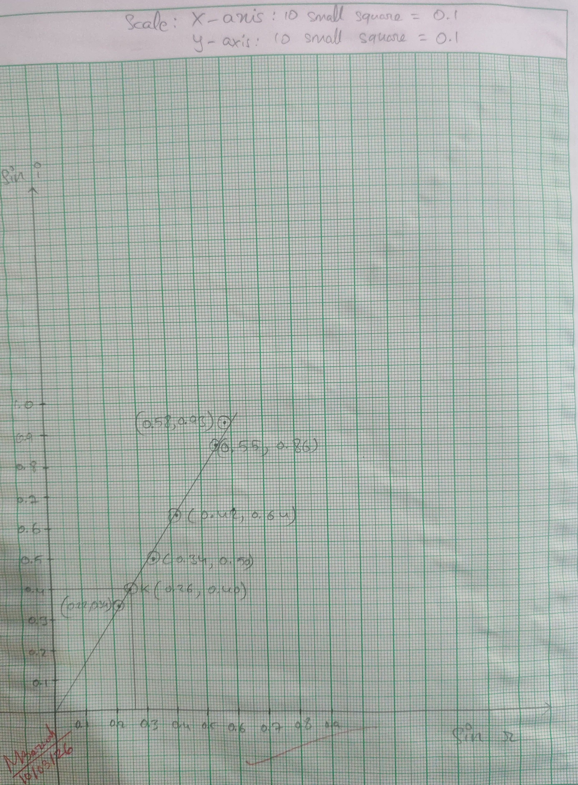

## Aim of the Experiment 
To determine the refractive index of glass slab by pin method. 

## Apparatus Required 
Glass slab, drawing board, drawing pins, hair pins, paper, scale and protractor. 

## Theory 
The refractive index, $\mu$ of glass with respect to air is defined as - 

$$
\mu = \frac{\sin i}{\sin r}
$$

where i is the angle of incidence and r is the angle of refraction. Thus a graph is plotted with sin r along X-axis and sin i along Y-axis. The graph is a straight line passing through the origin. The slope of the graph gives the value of $\mu$. 

## Procedure 
1. The white paper is fixed on the drawing board with the help of drawing pins. The glass slab is placed at its middle and its outline is drawn. 
2. A pin is fixed vertically at the center of the upper side. The second pin is put vertically, such that the line joining their pricks meet at the surface obliquely. Now seeing the slab from the other side, two other pins are fixed vertically such that the feet of these two pins and the other refracted images line in the same straight line. The pins at the pricked positions are removed after marking these positions with small circles. 
3. The experiment is repeated five times exactly in similar way by keeping the position of incidence fixed and successively inclining the positions. The position of pins are marked and then removed. 
4. The slab is removed. A normal is drawn at the point of incidence and the incident ray, refracted ray and emergent ray are drawn. 
5. The angle of incidence and refraction are measured. 
6. The sines of angles of incidence and refraction are found from the table. 

## Observation Table 
| S. no. | $\angle i$ | $\sin i$ | $\angle r$ | $\sin r$ | $\mu$ (from graph) | 
|:-:|:-:|:-:|:-:|:-:|:-:|
| 1. | $20\degree$ | 0.34 | $13\degree$ | 0.22 | | 
| 2. | $30\degree$ | 0.50 | $20\degree$ | 0.34 | | 
| 3. | $40\degree$ | 0.64 | $25\degree$ | 0.42 | 1.53 | 
| 4. | $60\degree$ | 0.86 | $34\degree$ | 0.55 | | 
| 5. | $70\degree$ | 0.93 | $36\degree$ | 0.58 | | 

## Plotting of Graph 
Taking the length of 10 small square = 0.1, $\sin r$ is plotted along X-axis and $\sin i$ is plotted along Y-axis. The graph is a straight line passing through the origin. The slope of graph is found out. 

## Result 
- Refractive index of glass, $\mu$ = $\frac{\sin i}{\sin r}$
    - $\implies$ slope of graph 
    - $\implies \frac{0.40}{0.26}$
    - $\implies 1.53$

## Precautions 
1. The difference of angles of incidence should not be less than $5\degree$. 
2. Pins should be fixed exactly vertically. 
3. The direction of rays should be marked by arrows. 
