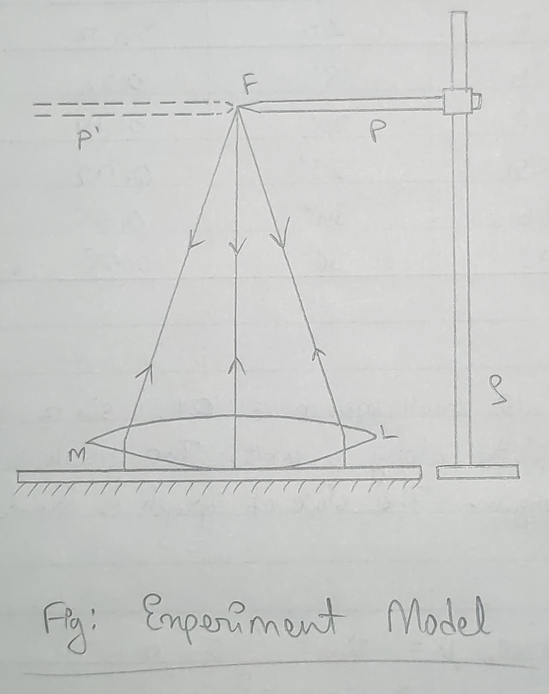
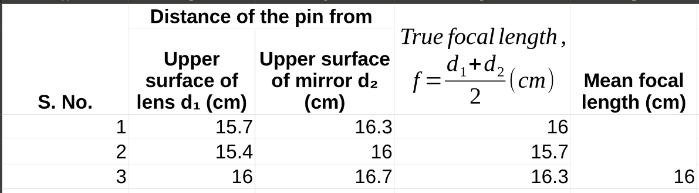

## Aim of the Experiment 
To determine the focal length of concave lens by plane mirror method. 

## Apparatus Required 
Convex lens, plane mirror, stand with clamps and object pin. 

## Theory 
If an object is placed at the principle focus $F$ of a convex lens $L$, the rays will emerge out from the lens as a parallel beam. If these rays are received on a plane mirror $M$ be placed at right angles to the rays, they will retrace their path along the same route and will converge to the same principal focus producing an image at the same position as the object. When this condition is fulfilled, the object coincides with the principal focus. Hence, the distance of the object at this position from the optical center of the lens gives the focal length of the lens. The position of coincidence of the object and its own image is determined by using parallax method. 

- $f$ = focal length of the lens 
- **d_1,\ d_2** = distances of the object from the upper surface 
- **f = \frac{d_1 + d_2}{2}**

## Procedure
1. The plane mirror $M$ is placed on the table or a sitting stool with its face turned upwards and the convex lens $L$ is placed on it. 
2. The object pin $P_1$ called pointer is then set up on a vertical adjustable stand $S$ in such a way that it is held in a horizontal position. The position of the stand is altered until the tip of the pointer, when looked from above vertically downwards, is placed vertically above the center of the lens. 
3. When the pin is at an appreciable distance from the lens, an inverted image of the pin is seen when viewed vertically downwards from above. The height of the pointer is slowly adjusted till the image $P'$ and the pin $P$ becomes coincident with each other. When this condition is arrived at, there will be no parallax between the tip of the pin and the tip of the inverted image. The pointer is thus placed at the principal focus of the lens. 
4. The vertical distance $(d_1)$ between the tip of the pin and the upper surface of the lens is measured and also the distance $(d_2)$ between the tip of the pin and the upper surface of the plane mirror. Then means of these two distances gives the focal length of the lens. 
5. The experiment is repeated at least thrice attempting to place the pin at the principal focus each time. 

## Observation 

## Result 
The focal length of the lens is found out to be **16 cm**.

## Precautions 
1. The principle axis of the lens should be horizontal. 
2. All parallax error should be removed during observation. 
3. The experiment should be performed with a rigid support and clamp. 
