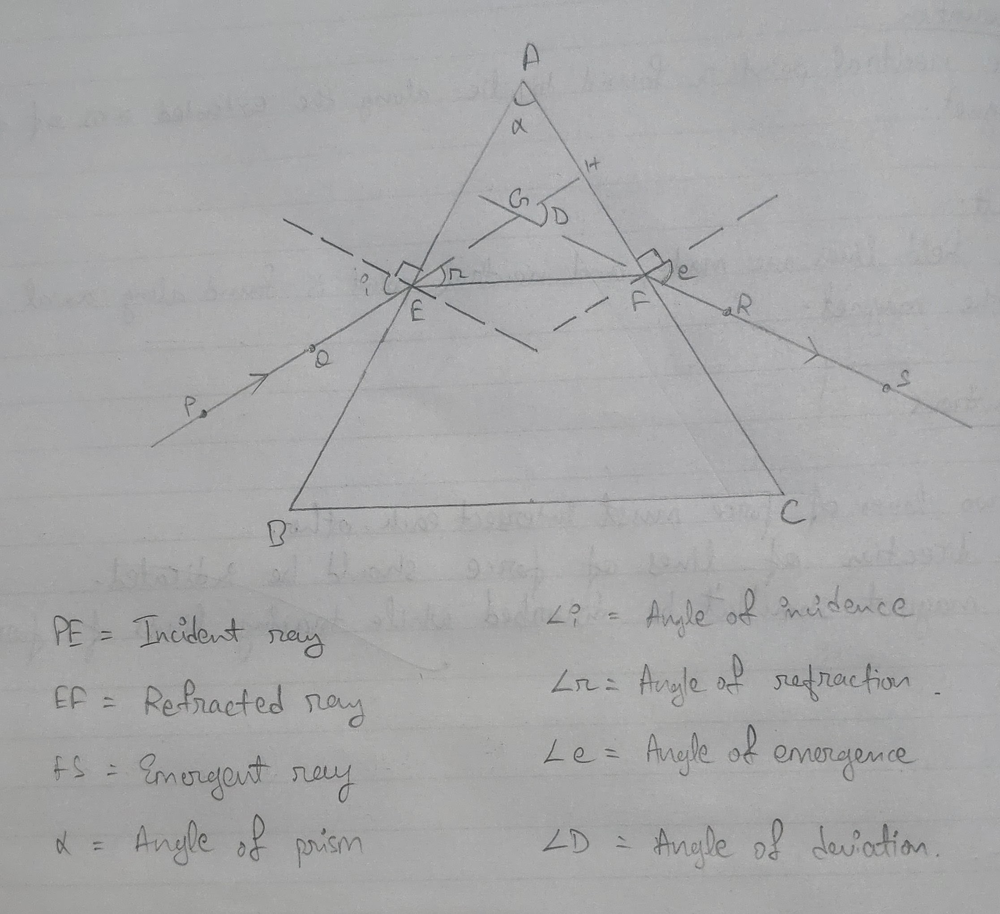
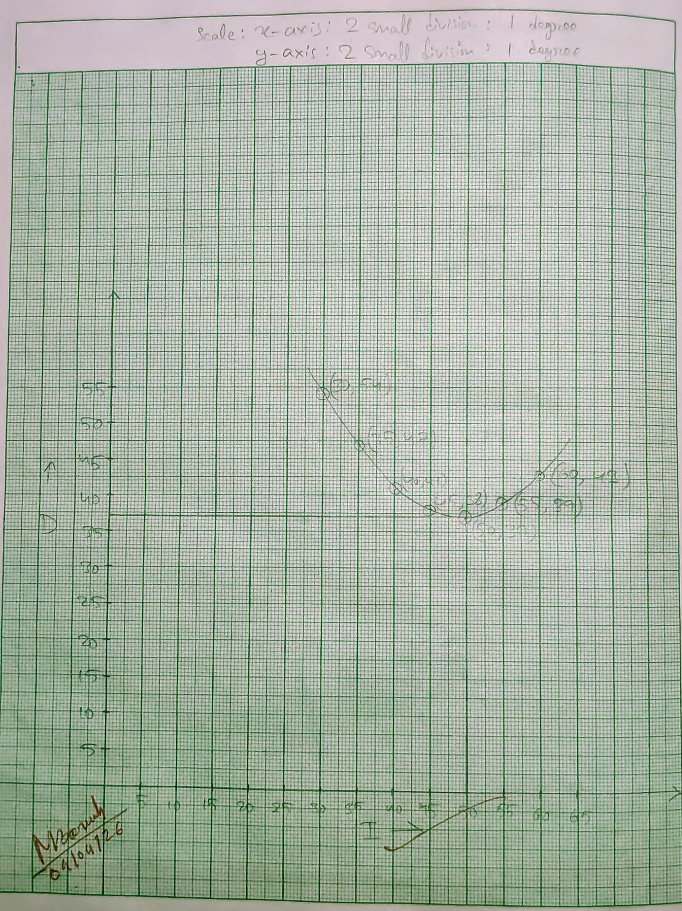
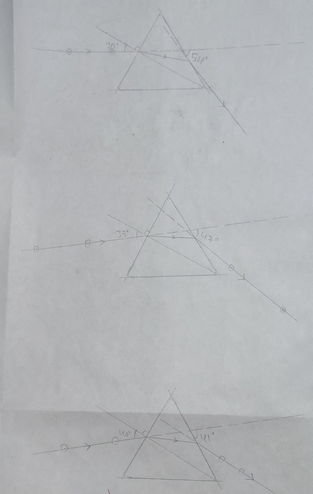
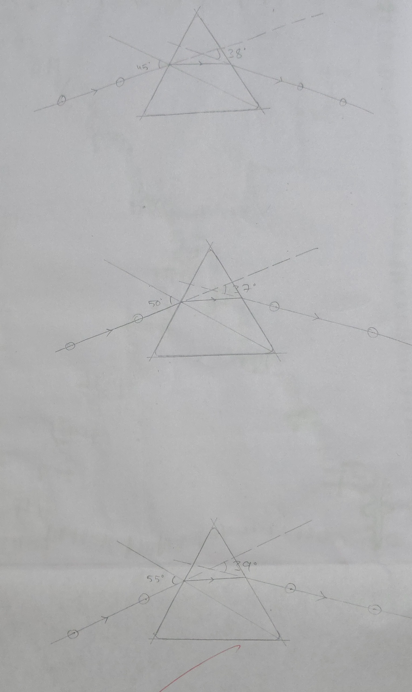
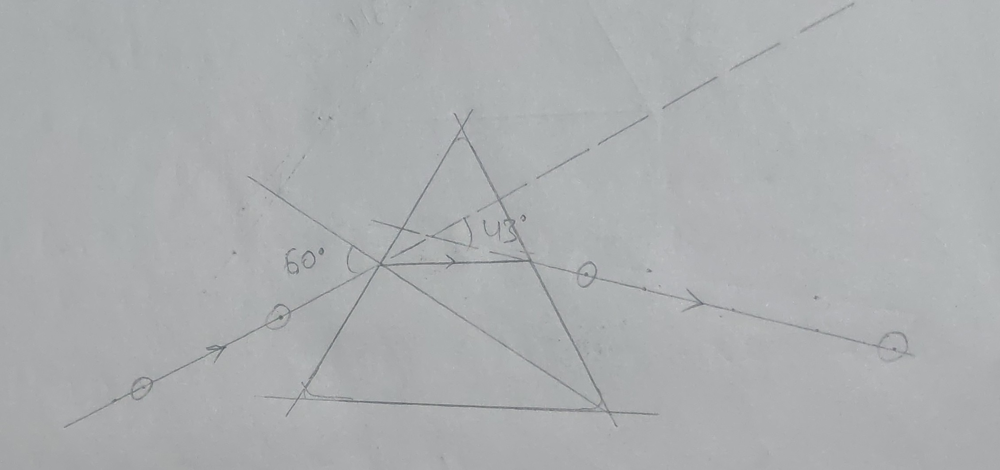

## Aim of the Experiment
To draw the I-D curve and to determine the refractive index of the material of a prism.

## Apparatus Required 
Drawing board, white paper, prism, pins, pencil, scale, protractor and drawing pins. 

## Theory 
The angle D included between the direction of the incident ray AB and the direction of the emergent ray CE (produced backwards) is the angle of deviation corresponding to the angle of incidence ABN. The deviation varies with the angle of incidence. It becomes minimum at a particular angle of incidence, depending on the angle of the prism and the material of the prism. The refractive index of the material of the prism for a particular color of light is given by, 

$$
\mu = \frac{\sin i}{\sin r} = \frac{\sin \alpha+D_m/2}{\sin \alpha/2}\ \text{, where } \alpha = \text{ prism angle}
$$

## Procedure 
1. A sheet of white paper is fixed on the drawing board. 
2. A line AB representing a face of the given prism is drawn. At a point N on this line, normal KN and a line MN representing an incident ray are drawn.
3. The prism is placed on the sheet so that its one face coincides with the line AB. Refracting edge A of the prism should be vertical. 
4. Two pins $P_1$ and $P_2$ are fixed on the line MN. Looking into the prism from the opposite refracting surface AC, one-eye is positioned such that feet of $P_1$ and $P_2$ appear to be one behind the other. Now two pins $P_3$ and $P_4$ are fixed in line with $P_1$ and $P_2$ as viewed through the prism. 
5. The pins are removed and their positions are marked. A scale is put along side AC and the prism is removed. A long line is drawn representing surface AC. Draw line joining $P_3$ and $P_4$. Extend line $P_2P_1$ and $P_4P_3$ so that they intersect at F. The angle of prism ($\angle BAC$) are measured. 
6. The experiment is repeated for at least five different angles of incidence between $30\degree$ and $60\degree$ at intervals of $5\degree$. 

## Observation Table 
| S.No. | Angle of incidence, I (degree) | Angle of deviation, d (degree) | Angle of prism, $\alpha$ (degree) | 
|:-:|:-:|:-:|:-:|
| 1. | 30$\degree$ | 54$\degree$ | 60$\degree$ | 
| 2. | 35$\degree$ | 47$\degree$ | 60$\degree$ | 
| 3. | 40$\degree$ | 41$\degree$ | 60$\degree$ | 
| 4. | 45$\degree$ | 38$\degree$ | 60$\degree$ | 
| 5. | 50$\degree$ | 37$\degree$ | 60$\degree$ | 
| 6. | 55$\degree$ | 39$\degree$ | 60$\degree$ | 
| 7. | 60$\degree$ | 43$\degree$ | 60$\degree$ | 

## Calculation 

$$
\mu = \frac{\sin i}{\sin r} = \frac{\sin (\frac{\alpha + D_m}{2})}{\sin \frac{\alpha}{2}} = \frac{\sin (\frac{60+37}{2})}{\sin \frac{60}{2}} = 1.49
$$

## Result 
The refractive index of the prism is **1.49**. 

## Precautions 
1. Pins should be perfectly vertical to the drawing board. 
2. Distance between pins should be sufficient to improve accuracy of traces. 
3. The prism should be properly aligned with its base on the paper and not disturbed during the experiment. 
4. Eyes should be at the same level as the pins when sighting. 

