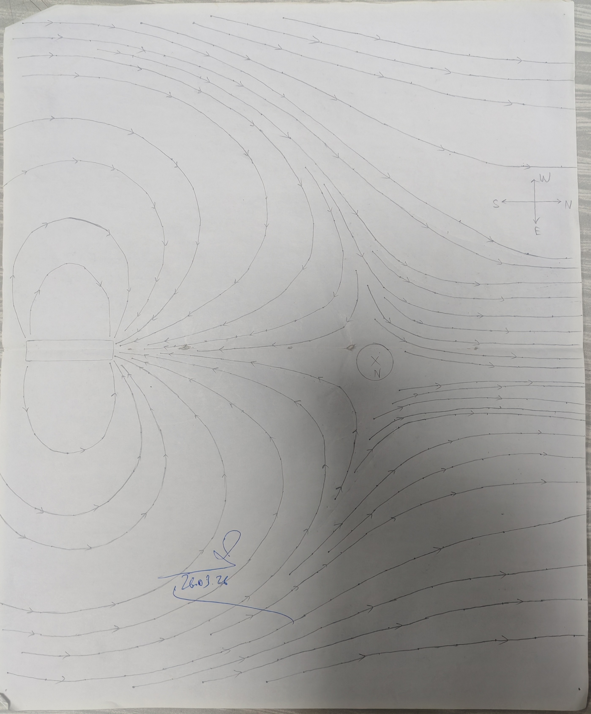

## Aim of the Experiment 
To plot magnetic lines of force of a bar magnet with south pole pointing north and to locate the neutral point. 

## Apparatus Required 
Bar magnet, magnetic compass, drawing board, drawing pins, sheet of white paper 

## Theory 
A magnetic line of force is a curve in a magnetic field and such that a tangent to it at any point gives the direction of the magnetic field at that point.  
The direction of the axis of a freely suspended magnetic needle gives the direction of resultant field. If the successive positions of the needle are found out from one end of a magnet to the other and a line is drawn, it will represent a line of force.  
While tracing the lines of force in a magnetic field due to a magnet we come across points where the field due to magnet and the horizontal intensity of earth's field are neutralized by each other. Such points are called neutral points. A compass needle placed at these points tends to remain in any direction in which it is kept.  
When the south pole of a magnet points towards the geographical north, the neutral point lies on the axial line. 

## Procedure 
1. The paper is fixed on the board using brass pins or quick fix. All magnetic substances are removed from the table. 
2. The magnet is placed near in right or left hand edge midway between the upper and lower edges of the paper and its outline is drawn. 
3. The magnet is removed. The compass needle is placed within the outline and the board is rotated till the length of the needle and that of the outline are exactly parallel to each other. The boundary of the board is now marked with a piece of chalk. 
4. The magnet is placed within the outline with its south pole pointing towards the geographical north. The magnet is now along the magnetic meridian. 
5. The compass needle is placed near the S-pole of the magnet. When the needle comes to rest, its position is marked by two dots by pencil. 

The needle is then shifted to a position such that its north pole lies on the dot occupied by the south pole just previously. Corresponding to the end of the north pole another dot is put. This process is repeated till north of the magnet is reached. 

6. All the marked points are now joined by drawing free hand curve. Its direction is indicated by an arrow mark from north to south. Thus one line of force is mapped. 
7. In this way starting from various points near the S-pole of the magnet, lines of forces are plotted successively in both sides of the magnet.
8. A few lines are drawn placing the needle at a fair distance from the magnet. These line of force are due to earth's magnetic field. 
9. It is observed that there is a space which is nearly bounded by all four lines, their curvature enclosing an empty area. 

The region is the neutral point region. More lines of force are drawn near this on all fronts.  
A curvilinear quadrilateral will be formed by the lines of force. Within this boundary the compass needle is marked. The center of this gives the position of the neutral point. The needle is not affected by either of the two poles here. 

## Observation 
The neutral point is found to lie along the extended axis of the magnet. 

## Result 
The field lines are made, and neutral point is found axial with the magnet. 

## Precautions 
1. No two lines of force should intersect each other. 
2. The direction of lines of force should be indicated. 
3. The magnet shouldn't be disturbed while tracing lines of force.
