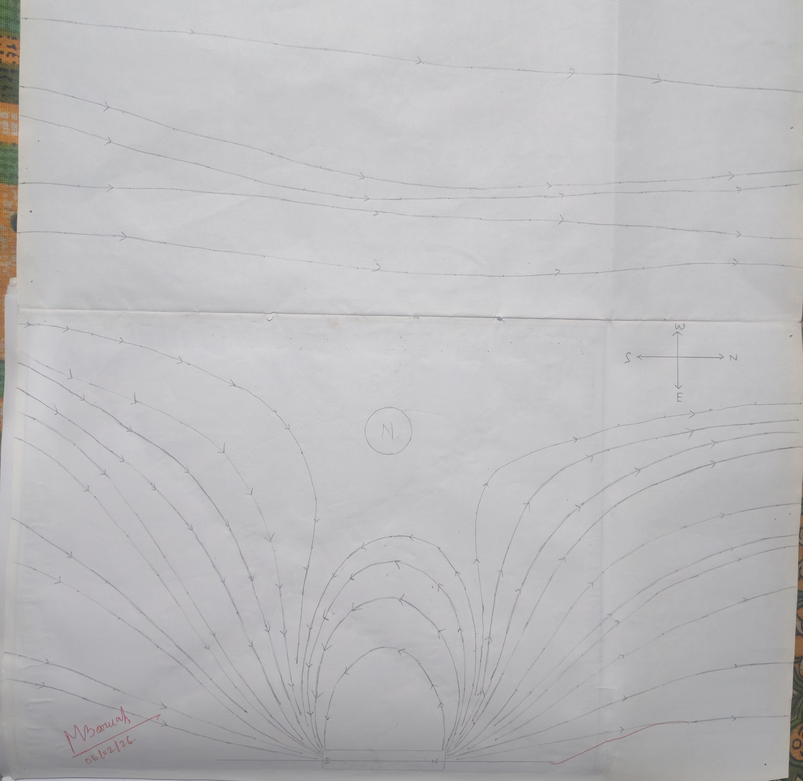

## Aim of the Experiment 
To trace the lines of force on one side due to a bar magnet, placed in the magnetic meridian with its north pole pointing north and mark the position of neutral point. 

## Apparatus And Material 
Bar magnet, compass needle, sheet of white paper, drawing board and brass pins and sharp pencil. 

## Theory 
A magnetic line of force is a curve in a magnetic field and such that a tangent to it at any point gives the direction of the magnetic field at that point.  
The direction of the axis of a freely suspended magnetic needle gives the direction of resultant field. If the successive positions of the needle are found out from one end of a magnet to the other and a line is drawn, it will represent a line of force.  
While tracing the lines of force in a magnetic field due to a magnet we come across points where the field due to magnet and the horizontal intensity of earth's field are neutralized by each other. Such points are called neutral points. A compass needle placed at these points tends to remain in any direction in which it is kept.   
For N-pole of a magnet pointing the geographic north, neutral point lie on the perpendicular bisector to its length. 

## Procedure 
1. The paper is fixed on the board using brass pins or quick fix. All magnetic substances are removed from the table. 
2. The magnet is placed symmetrically near the lower edge of the paper and its outline is drawn. 
3. The magnet is removed. The compass needle is placed within the outline and the board is rotated till the length of the needle and that of the outline are exactly parallel to each other. The boundary of the board is now marked with a piece of chalk. 
4. The magnet is placed within the outline with north pole pointing towards the geographical north. The magnet is now along the magnetic meridian. 
5. The compass needle is placed near the N-pole of the magnet. When the needle comes to rest, its position is marked by two dots by pencil. 

The needle is then shifted to a position such that its south pole lies on the dot occupied by the north pole just previously. Corresponding to the end of the north pole another dot is put. This process is repeated till south of the magnet is reached. 

6. All the marked points are now joined by drawing free hand curve. Its direction is indicated by an arrow mark fron north to south. Thus one line of force is mapped. 
7. In this way starting from various points near the N-pole of the magnet lines of forces are plotted successively in the upper half of the field. 
8. A few lines are drawn placing the needle at a fair distance from the magnet. These line of force are due to earth's magnetic field. 
9. It is observed that there is a space which is nearly bounded by all four lines, their curvature being oppositely turned. 

The region is the neutral point region. More lines of force are drawn near this on all our fronts. 
A curvilinear quadrilateral will be formed by the lines of force. Within this boundary the compass needle is marked. THe center of this gives the position of the neutral point. The needle is not affected by either of the two poles here. 

## Result 
The magnetic lines of force on one side of a bar magnet with its north pole pointing towards the geographic north are shown on the paper. A neutral point is located on the perpendicular bisector to the length of the magnet on one side. 

## Precautions 
1. There should be no magnetic materials in the vicinity of the magnet. Drawing pins should be made of brass. 
2. While plotting the lines of force the position of the drawing board or that of the magnet should in no case be disturbed.
3. The directions of the lines of force should be indicated. 
4. No two lines of force should intersect at any point. 

